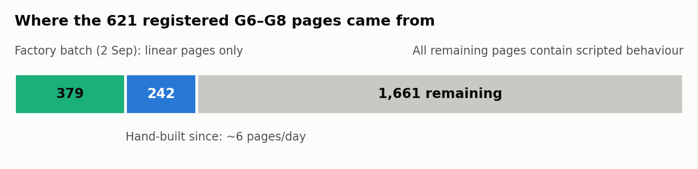
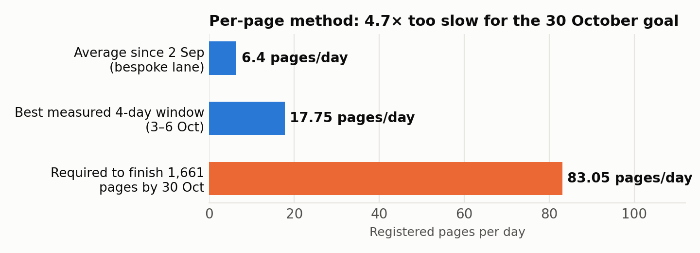
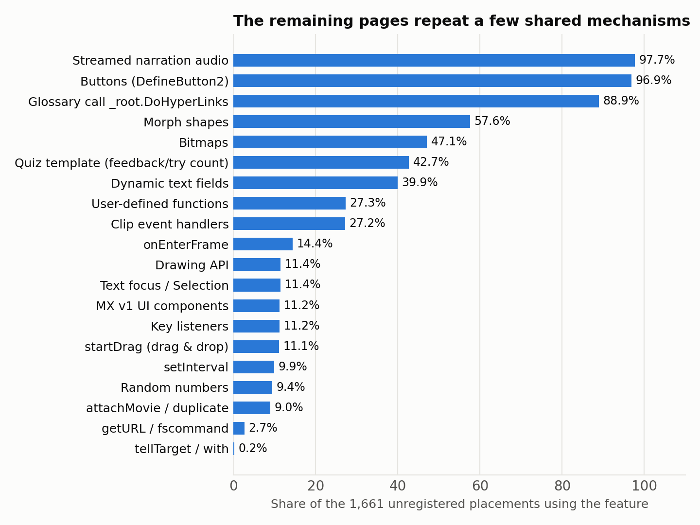
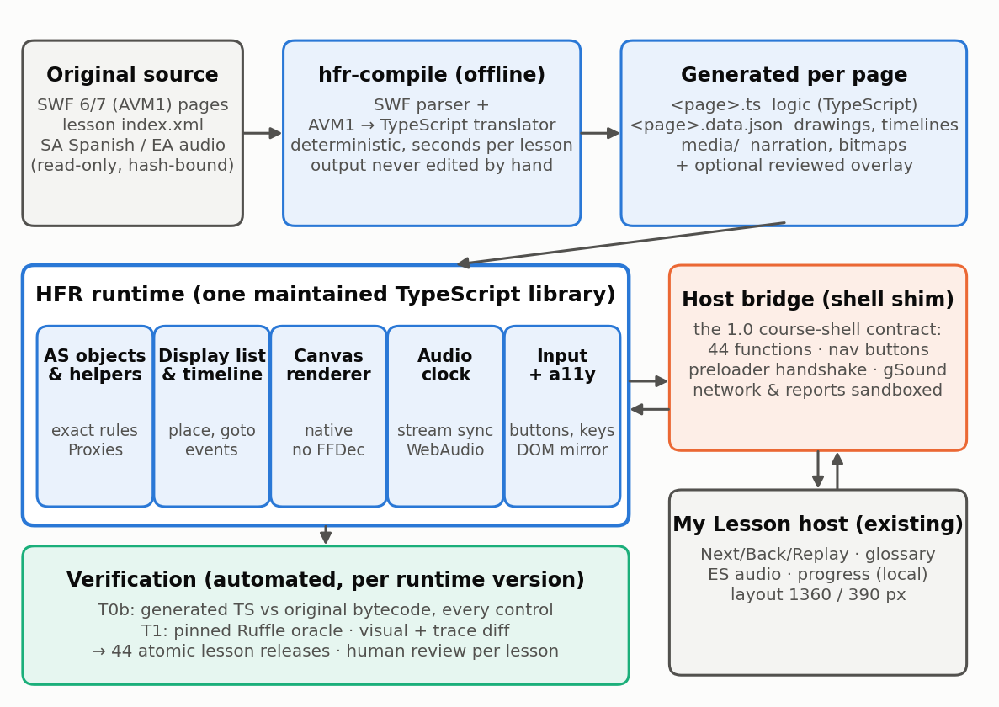
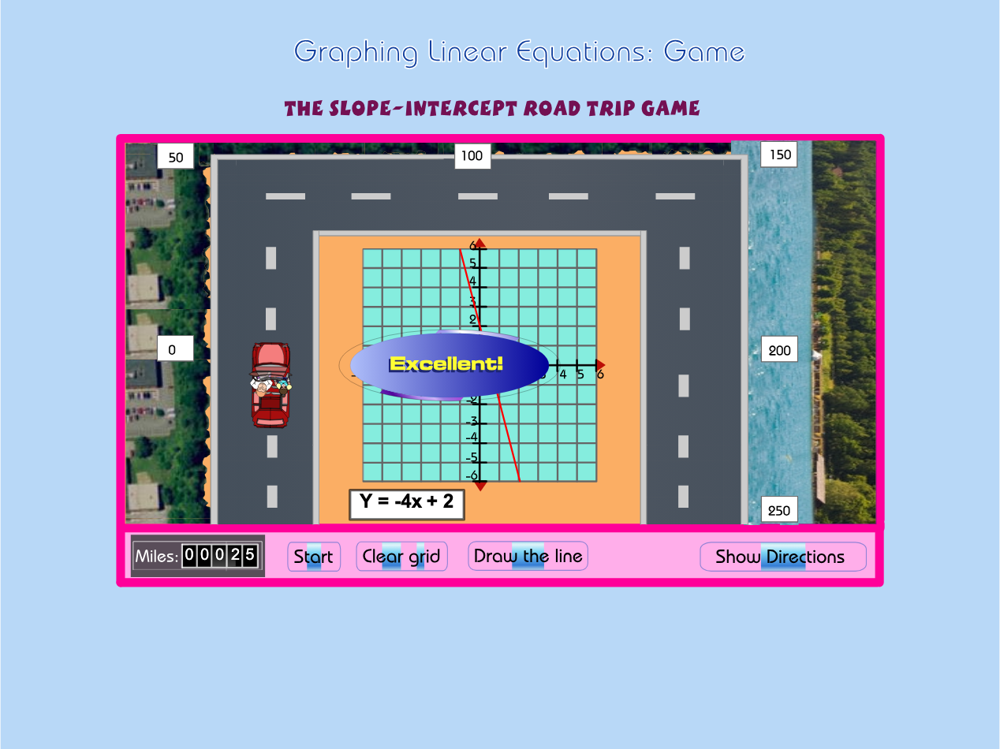

# G6–G8 Flash-to-JavaScript Conversion

**Why it is slow, and a high-efficiency way to finish it: the HELP Flash Runtime (HFR) with TypeScript output**

- Prepared for Dr. Peter Hu (PedaNova) and the HELP Math 2.0 engineering team
- Prepared by Claude (Claude Code) · 10 October 2026, Asia/Taipei · Revision 2, 11 October 2026
- Revision 2: “HFR with TypeScript output” adopted as the official target (Owner, 10 Oct); a sample conversion of NMS Lesson 7 (52 pages) and P040/P050 added (Section 6.2)
- Basis: the Codex report “G6-G8_Current_JS_Detailed_Report_2026-10-10”, the live G6–G8 worktree (read-only), the G6–G8 and G3–G5 source corpora, and a feasibility prototype built for this review

> Status: recommendation for Owner decision. Analysis and prototype only; no change was made to the G6–G8 worktree, registry, admission files or evidence.

## About this review

This document answers one question: **why converting the G6–G8 Flash lessons into JavaScript has been so slow for Codex, and what engineering approach would finish the job efficiently** without lowering the project’s standards. It is written for the engineering team and for the Owner’s decisions.

**What was done.** The G6–G8 implementation worktree, registry, release manifest, workflow log, handoffs and the 9 October efficiency study were read without modification. Every SWF file in the G6–G8 source view (2,853 files) and the G3–G5 views (2,074 files) was parsed with purpose-built scanners. A small headless ActionScript prototype was written in an isolated scratch folder and run against all 2,282 active G6–G8 placements. After the Owner chose “HFR with TypeScript output”, a working converter, runtime and viewer were built and used to convert a complete grade-6 lesson (NMS Lesson 7, 52 pages) and P040/P050 into TypeScript page modules, verified against the original bytecode and checked in a browser. The Codex worktree, registry, admission files and evidence were not changed, and the paused Codex session was not touched.

**What was not done.** No Ruffle differential comparison or My Lesson integration was performed, nothing was registered, and no fidelity, listening or Owner acceptance is claimed. Figures are dated 10–11 October 2026 and must be re-checked against live files before use.

## 1. Executive summary

> **Bottom line**
>
> - **The hard part is not the Flash content; it is the conversion method.** Each remaining page is converted by hand-writing a new React/TypeScript player that re-implements that page’s ActionScript behaviour, then proving that page individually with hundreds of hash pins, a dedicated compiler run and an eight-cell native-browser matrix. Throughput is linear in pages and gets worse as the project grows.
> - **Measured best rate: 17.75 pages/day. Required for 30 October: 83 pages/day.** At the best rate the 1,661 remaining pages finish around mid-January 2027; at the average rate since 2 September (≈6.4 pages/day) they finish in mid-2027.
> - **Why it is done this way:** the only automatic path, the FFDec HTML5-Canvas export, draws timelines but cannot execute ActionScript. It produced 379 linear pages in one batch on 2 September; every page with scripted behaviour (all 1,661 remaining) fell to the manual lane.
> - **The content is ideal for a runtime.** All 2,282 placements are ActionScript 1/2 (AVM1), Flash Player 6/7, 800×600 at 12 fps, built from shared templates. They use 63 bytecode instructions, no AS3, no video and no filters, and they talk to the old course shell through a fixed set of 44 functions. G3–G5 are identical in format.
> - **Recommendation (adopted): HFR with TypeScript output. Convert pages automatically instead of rewriting them by hand.** A converter translates each page’s original ActionScript bytecode into a readable **TypeScript page module** and its drawings and timelines into a data file. One maintained **TypeScript runtime library** plays every page and plugs into My Lesson through one shell adapter, the way Adobe Animate’s HTML5 export relies on CreateJS. No Flash Player, plugin or SWF is involved at run time. The effort moves from 1,661 hand-written pages to one converter and one runtime plus automated verification.
> - **Feasibility evidence:** a headless prototype runs all 2,282 placements in under 20 seconds; 2,281 complete without reaching an unimplemented instruction or built-in. Two small adapter additions fixed 196 pages at once, which is the economics of the shared-runtime approach.
> - **Sample conversion (Section 6.2):** the converter turned all 52 pages of NMS Lesson 7 “Ratios & Proportions” (grade 6) plus P040 and P050 into 54 TypeScript modules in about 2.5 seconds. **Every one of the 2,378 code bodies became structured TypeScript, and 54 of 54 pages behave identically to the original bytecode** after every control is exercised. The modules pass `tsc`, all 52 pages render in the browser with zero runtime errors, and P040’s game plays a full round. Across the whole G6–G8 corpus, 99.67% of 118,923 code bodies translate to structured TypeScript.
> - **Deadline outlook:** with Owner decisions this week, HFR can plausibly carry most remaining pages (target ≥ 90%) through automated verification by about 22 October and lesson-level review by 28–30 October. A pre-approved, clearly labelled Ruffle compatibility fallback (Track B) covers any residue, so every page can be playable with real interactions in private My Lesson by 30 October. Strict fidelity, listening and Owner acceptance remain separate gates.

#### Decisions requested this week (details in Section 11)

| # | Decision | Recommendation |
| --- | --- | --- |
| D1 | “HFR with TypeScript output” (generated TypeScript page modules + data + one maintained TypeScript runtime) as the Current-JS implementation tier for new G6–G8 work | Agreed by the Owner (10 Oct); record formally |
| D2 | Verify the runtime once and pages automatically; review humans per lesson, replacing per-page eight-cell matrices and per-page admission transactions for HFR pages | Yes |
| D3 | Use a pinned Ruffle as an automated test oracle, and pre-approve it as a labelled temporary fallback (Track B) for pages not passing HFR by 28 October | Yes (oracle); Yes, conditional (fallback) |
| D4 | Freeze the bespoke per-page lane (finish P040/P050 only if it takes one session or less); keep the 621 registrations as they are | Yes |
| D5 | Give HFR a hermetic workspace on the American Dream disk and stop evidence growth on WestWorld (≈1 GB free) | Yes |

#### Key numbers

| Measure | Value (10 Oct 2026) | Source |
| --- | --- | --- |
| Registered G6–G8 placements | 621 of 2,282 (27.21%); 1,661 remaining | registry ∩ release manifest |
| Pages from the 2 Sep factory batch | 379 (linear, no scripted behaviour) | calibration g678-16-page… |
| Pages hand-built since | 242, in 238 single-page and 2 two-page calibrations | private-current-js-registry.json |
| Best measured rate | 71 pages in 3–6 Oct = 17.75/day | workflow events.jsonl |
| Rate needed for 30 Oct | 83.05 pages/day (4.7× best) | 1,661 ÷ 20 days |
| Page-specific source files | ≈ 5,600 for 242 hand-built pages | file inventory |
| Evidence volume | output/ 87 GB, work/ 27 GB | du |
| Source format | 100% AVM1, SWF 6 (95%) / 7, 800×600, 12 fps | SWF scan |
| Distinct AVM1 instructions | 63 across active placements | full static inventory |
| Course-shell API used | 44 functions on _root/_level0 | bytecode scan |
| Prototype result | 2,281/2,282 run clean; 8–17 s for the corpus | HFR spike v3 |
| Sample conversion | NMS L7 (52 pages) + P040/P050 → 54 TypeScript modules; 54/54 behaviour identical | hfr-sample verification.json |
| Corpus translation coverage | 99.67% of 118,923 code bodies → structured TypeScript; 0 syntax errors | converter run over 2,851 SWFs |

---

## 2. Where the work stands

The Codex report is accurate about the facts it covers; this section restates the parts that matter for the diagnosis and adds what the worktree shows about how the 621 registered pages were produced.



*Figure 1. Composition of the 2,282-placement goal. The September factory batch covered only pages whose behaviour is linear; everything with scripted behaviour has been built by hand.*

| Strand | Registered | Total | Remaining | Coverage |
| --- | --- | --- | --- | --- |
| NMS (Numbers Make Sense) | 153 | 638 | 485 | 24.0% |
| GEO (Go Figure!) | 83 | 595 | 512 | 13.9% |
| ALG (From ABC to XYZ) | 353 | 647 | 294 | 54.6% |
| DAT (How Likely!) | 32 | 402 | 370 | 8.0% |
| Total | 621 | 2,282 | 1,661 | 27.2% |

- **Two production modes exist.** One calibration (registered 2 September) contains 379 entries whose runtimes are FFDec-generated `canvas-renderer.js` files built by factory scripts such as `build-g678-pure-linear-current-js-scaleout.mjs`. The other 242 registrations each have their own calibration, freeze manifest, maintained player and admission proof. The freeze manifest for ALG L8 P048 reached version `final-v19`.
- **The registered pages are the easy ones.** The median registered page carries 75 bytes of ActionScript; the median remaining page carries 898 bytes. Remaining pages are more interactive, but still small in absolute terms.
- **Workflow log:** 134 finished units claimed 130 newly integrated pages; 112 units were advanced-manual, 16 factory and 6 infrastructure (zero pages). There were 191 rework observations, about 1.5 per page.
- **Daily output:** 19, 16, 17 and 19 pages on 3–6 October, then 8, 0, 6 and 5 on 7–10 October. On 10 October the Owner paused work at 621 with P040 and P050 unregistered, a compiler pass recorded for an earlier P040 candidate, and the eight-cell browser matrix still pending.
- **Storage:** the worktree holds 87 GB of `output/` and 27 GB of `work/` (25 GB in the shared page factory). The WestWorld disk has about 1 GB free.



*Figure 2. Measured delivery rates against the rate needed to finish 1,661 pages between 11 and 30 October.*

## 3. Root-cause analysis

The Codex report lists the immediate difficulties: Spanish-audio ownership on P040, native window visibility in the browser driver, compiler memory exhaustion, evidence rebinding after small edits, and a finalisation that failed after a successful browser run. Each is real. But they are **symptoms of seven structural causes**, ranked here by their effect on throughput.

### RC1. The unit of work is a hand-written page, because the toolchain has no ActionScript engine

The team’s only automated converter is FFDec’s HTML5-Canvas export. It emits drawing functions for shapes, morph shapes, text and images, plus sprite functions with the timeline baked into a frame `switch`. It **does not execute ActionScript**. That is why the factory could register 379 linear pages in one transaction and then stopped: every page whose behaviour depends on scripts (buttons, feedback, quizzes, games, glossary links, drag and drop, random choices) needs that behaviour re-implemented.

Re-implementation is done per page by an agent reading decompiled ActionScript and writing new TypeScript: source clocks, audio schedules, glossary state, hit regions, text presentation, state machines and tests. For the 242 hand-built pages the worktree holds about **5,600 page-specific files**: 2,260 in `packages/demos/src` (234 page prefixes, median ≈ 10 files and ≈ 330 lines per page), 1,249 page modules in `apps/web/lib`, 423 components, 1,534 scripts and 161 `admission-semantics` modules.

A concrete example: the ALG L8 “Play It” game (L8GS02) has one button handler of about 80 lines of ActionScript that moves a car, rotates it at grid edges and updates a five-digit score display. The original bytecode already encodes that behaviour exactly. Under the current method it must be re-derived, re-typed, re-tested and re-proven by hand, and no part of that effort transfers to the next page: Codex’s own audit found 1,661 distinct hashes and 1,661 distinct structure fingerprints among the remaining placements.

### RC2. Verification is per page and per change, so its cost multiplies

Each hand-built page needs a page proof that binds its source, producer, implementation and historical evidence. P040’s current contract retains **670 original evidence pins**, 22 installed pins and 7 shared pins, and its proof file is 690 KB. Each page also needs a shared-host version, a guarded registration transaction, a selected-root TypeScript compiler run and an **eight-cell native-browser matrix**: English and Spanish, at 1,360 and 390 px, with root-font enlargement and reduced motion, including native window minimisation.

Any edit invalidates the chain and restarts it, hence P048’s 19 freeze versions and the 191 rework observations. The P042/P043 pair took 3 h 12 m for two pages: 66 minutes of browser execution, 2 minutes 20 seconds of production build and 124 minutes that could not be attributed. Verification cost is therefore roughly pages × changes × matrix cells.

### RC3. Code-per-page creates diseconomies of scale

Because each page adds TypeScript to the application, the selected-root type check now binds **2,762 program files**. It needs a 12 GiB heap cap and peaks at 4.5 GB RSS; versions v3 to v7 of the compiler run stopped on resource guards before v8 passed. Other recorded symptoms include a dev server that restarted after a 10.68 GB heap, ENOSPC failures that blocked manifest writes, and a single descriptor admission reading 60,757 files (6.6 GB) in the 9 October profile. Every additional page makes compiling, bundling and admission slower for all later pages. A runtime approach removes page code from the TypeScript program entirely.

### RC4. The process is serialised around a single writer

Pages share the registry, the generated dispatch, the host version and the browser server, so the workflow correctly allows only one canonical writer. Parallel agents can analyse but cannot add throughput, because the bottleneck is a shared mutable resource. Twelve-hour session rotations add long handoffs (74 handoff files in the worktree root) and custody work: process birth-time checks, owned process groups, and restoring `tsconfig.json` byte for byte after each server start.

### RC5. The native-browser test harness is fragile

Many recorded failures have nothing to do with lesson behaviour: Chrome launcher ctime drift, CDP endpoints that timed out, focus emulation enabled by new Playwright contexts, a 444-second cross-process observation gap, cold navigation taking 31 s against a 30 s limit, extension service workers, GainNode ownership, and PCM hash differences between Chrome 149 and 154. They are the cost of testing every page through a full native browser lifecycle instead of testing shared behaviour once.

### RC6. Optimisation effort targeted the wrong level

The 9 October efficiency study is careful work. It measured parser and pin-verification caching and achieved 25.8–43% reductions on local reader operations, which is seconds per page, while the cost is hours per page. It explicitly recommended rejecting “general AVM1 interpreter construction” and treated a player as unable to produce maintained behaviour. That premise, not a lack of engineering effort, kept throughput linear.

### RC7. Policy framing ruled out the structural fix

“Ruffle is forensic only” and “a player/emulator does not produce a maintained lesson implementation” are sensible guards against shipping an opaque third-party emulator. They have been applied so broadly that they also rule out a **project-owned TypeScript runtime** that executes original behaviour. Yet the project already accepts “generated from source plus a maintained runtime” for rendering: G3–G5’s descriptor-driven players and the 379 FFDec canvas pages work that way. HFR extends the same principle from drawing to behaviour.

> **What is not the root cause**
>
> - **Codex’s capability or diligence.** The work is careful, honest about limits and well evidenced; the method, not the agent, sets the rate.
> - **Missing FLA files.** SWF-only sources are sufficient: the bytecode is the behaviour, and a runtime needs no FLA.
> - **P040 specifically.** Its Spanish-audio and visibility issues are examples of RC2 and RC5; fixing them adds two pages.

## 4. What the corpus actually looks like

The case for a runtime rests on measurements of the source, not on assumptions. The scanners and their outputs are delivered with this report.

| Property | G6–G8 measurement | Implication |
| --- | --- | --- |
| ActionScript version | AVM1 in 100% of 2,851 parseable SWFs; no AS3 (DoABC) anywhere | One translation target, simplest Flash VM |
| SWF version | SWF 6: 2,723 · SWF 7: 127 · SWF 8: 1 | Flash MX / MX 2004 feature set; no filters or blend modes |
| Stage and frame rate | 800×600 and 12 fps in every file | One stage contract for every page |
| Bytecode instructions | 63 distinct opcodes across active placements; no try/throw, extends or cast | Small, well-specified translator and runtime |
| Rare constructs | with: 2 pages · tellTarget: ≤ 5 · getURL: 45 (mostly history.back) | Edge cases are countable |
| Media | Streamed narration in 2,589 files (MP3; ADPCM in a few); no video | One audio-sync model (MP3 + small ADPCM decoder) |
| Structure | Template: frame 1 preloader handshake, label “begin” on frame 6, main sprite “animation” | Shared lifecycle in the host adapter |
| Shell contract | 44 shell functions; 10 cover almost all calls | One adapter for all pages |
| G3–G5 | 2,074 SWFs, all AVM1, SWF 6/7, 800×600, 12 fps, same shell calls | The same runtime also serves G3–G5 |



*Figure 3. Features used by the 1,661 unregistered placements (full static inventory, including clip-event scripts). Bitmaps are counted from image tags.*

#### The course-shell contract

The 1.0 player loaded each page with `animation_mc.loadMovie(page)`. The page then talked to the player through `_root` / `_level0`. That contract is small and stable across all 73 lessons:

| Call or member | SWF files | Modern meaning in My Lesson |
| --- | --- | --- |
| _level0.InternalPreloader.gotoAndPlay("jump_check") | 2,759 | Page ready; host starts the page at label “begin” |
| _root.DoHyperLinks(…) | 1,904 | Activate glossary (Key Terms) links in page text |
| _global.KeyAttribute = … | 1,909 | Glossary configuration state |
| _root.animation_mc.animation.stop() | 1,901 | Stop the page’s main content sprite |
| _root.disableQuizButton() / enableQuizButton() | 806 / 794 | Lock or unlock the quiz controls in the host |
| _root.showRightFeed() / showWrongFeed() | 612 / 602 | Feedback event (correct or incorrect) for progress |
| _global.quizSection / quizTryCount = … | 1,169 / 749 | Quiz state shared with the host |
| _root.doPlayFQQuestionAudio() / doPlayFQAnswerAudio() | 121 / 121 | Final-quiz audio, EN or ES |
| _root.setBookMark() / doCloseApp() | 52 / 52 | Progress bookmark, exit lesson |
| _root.back_mc / next_mc / replay_mc / pause_mc .gotoAndStop("active"\|"inactive") | tens | Enable or disable host navigation buttons |
| _global.gSound.setVolume(…) | 13+ | Host volume control |
| Send_Quiz_Report_Mc, strQuiz_Report_URL, getURL | ≈ 120 | Legacy reporting and network: sandboxed, never sent |

Pages call `showRightFeed`, `ShowRightFeed` and `showRightfeed` interchangeably. That only works because SWF 6 resolves names case-insensitively, a rule the runtime must implement and a typical trap for hand rewrites.

## 5. The solution: HFR with TypeScript output

### 5.1 Principle: translate automatically, verify against the original, modernise around it

Every Flash page becomes TypeScript, but no person writes it. The **converter** (hfr-compile) translates each page’s original ActionScript bytecode into a readable **TypeScript page module**, one named function per frame script, button and clip event, and its drawings, timelines and text into a **data file**. One maintained **TypeScript runtime library** supplies what every page needs: display list, timeline, Canvas renderer, narration sync, input, and the course-shell adapter for My Lesson. This is the same split Adobe Animate’s HTML5 Canvas export uses (generated JavaScript plus the CreateJS library).

Because the logic is translated mechanically from the bytecode, it is source-faithful by construction and needs no per-page behaviour recovery. Every translation is **checked automatically** by running the generated TypeScript and the original bytecode (through a reference interpreter kept only for testing) side by side on the same runtime. Modernisation (host integration, accessibility, Spanish, layout, privacy) lives in the shared runtime and in small, reviewed per-page overlays. Generated files are never edited by hand.



*Figure 4. HFR with TypeScript output. Blue: converter, generated output and runtime. Orange: the shell adapter. Grey: existing assets. Green: verification.*

### 5.2 Components

The sample (Section 6.2) already implements a first version of every component below in about 3,200 lines. The estimates are for the production version.

| Component | Responsibility | Sample status | Production est. |
| --- | --- | --- | --- |
| hfr-compile: SWF parser and data writer (Node, offline) | Shapes (fill0/fill1 edge assembly → SVG path data in twips), morph shapes, fonts (glyph outlines + code tables), static and dynamic text, buttons, bitmaps (JPEG repair, lossless → PNG), timelines, exports, stream audio → MP3/WAV with a frame↔sample map. Deterministic; output keyed by SHA-256(SWF) + compiler version. | Working (415 + 149 + 173 lines) | 1.5k lines |
| hfr-compile: AVM1 → TypeScript translator | Rebuilds expressions from the operand stack and structured control flow (if/else, while, do-while, for(;;), for-in, &&, \|\|, ?:) from the Flash compiler’s jump patterns; handles the Macromedia component compiler’s register save/restore and shared-exit returns; one named, commented function per script. Unprovable blocks use an exact explicit-stack translation. | Working (573 lines): 100% structured on the sample, 99.67% on the corpus | 1.2k lines |
| Runtime: ActionScript object model and helpers | Objects, prototypes, scope chains, closures, registers, DefineFunction2 preloads, SWF 6 case rules and coercions; exact operator helpers (add, eq, lt, truthy …) and JavaScript Proxies so generated code reads naturally. The bytecode interpreter stays as the test oracle. | Working (502 + 125 lines) | 2k lines |
| Runtime: display list, timeline and built-ins | Place/move/replace/remove, goto with rewind, frame-script and event order, attachMovie/duplicate, depths, masks, button state machine, drawing API, drag and drop, bounds and coordinate conversion; MovieClip, Button, TextField, Array, String, Math, Date, Color, Key, Mouse, Selection, Stage, Sound, intervals; Flash MX v1 components run as generated code. | Working (771 lines) | 2.5k lines |
| Runtime: Canvas renderer | Native renderer (no FFDec or Ruffle code): fills, gradients, bitmap fills, strokes, morph interpolation, glyph-based static text, dynamic text with embedded fonts, masks, colour transforms; geometry-based hit testing. | Working (244 lines) | 1.5k lines |
| Runtime: audio clock | Flash streaming semantics (timeline follows the narration clock), event and button sounds, volume, pause/visibility, Spanish channel. | Working (60 lines) | 0.8k lines |
| Runtime: input and accessibility | Pointer, touch and keyboard to button states and clip events; focus; an off-canvas DOM mirror of text and accessible button proxies. | Input working; accessibility mirror not yet | 1k lines |
| Host bridge (shell adapter) | The 44-function course-shell contract, navigation buttons, preloader handshake, gSound and text flags, mapped to My Lesson events; network and reporting sandboxed. | Working (in display.ts) | 0.6k lines |
| Verification | Translation equivalence (generated TS vs original bytecode), headless explorer, Ruffle differential oracle, visual diff, lesson release manifests, review UI. | Equivalence check working (75 lines); Ruffle oracle not yet | 2k lines |

### 5.3 Page modules, data files and overlays

Each page compiles to `<placement>.ts` (logic), `<placement>.data.json` (drawings, timelines, text, buttons, narration map) and its media files. These are generated and never hand-edited: a converter or runtime fix is applied by regenerating every page, which takes seconds. If a page must differ from the original (a corrected math error, a translated label, a layout tweak for 390 px), the change is an **overlay**: a small, named, reviewed TypeScript or data patch that replaces one generated script or asset by name and is listed in the lesson release manifest. Behaviour changes are therefore explicit and auditable.

### 5.4 Modernisation, done once

- **Host integration:** Next/Back/Replay, pause and visibility, the glossary panel, feedback and progress events and exit all come from the shell adapter, so every page behaves consistently in My Lesson.
- **Spanish:** the runtime routes the source `SA/` Spanish narration and the final-quiz Spanish audio through the host ES toggle. Full Spanish on-screen text remains the product decision in issue #75; overlays make translated text possible page by page without code.
- **Accessibility:** text in DefineText and EditText records is decoded with each font’s code table and mirrored into an accessible DOM layer; buttons become keyboard-focusable proxies over their hit areas. The previous approach would need this per page.
- **Responsive layout:** the 800×600 stage scales inside the host. At 390 px the host offers zoom and pan or landscape guidance. Reflowing native text page by page is not achievable at this scale, so this is an explicit product trade-off.
- **Privacy and safety:** legacy reporting clips, getURL, LoadVars and XML calls are no-ops with a log entry; no network endpoint from legacy ActionScript is ever contacted (AGENTS.md rule). Randomness and time are deterministic in test mode.

### 5.5 How HFR fits the project’s own rules

| Project rule (AGENTS.md / flash-to-js skill) | How HFR complies |
| --- | --- |
| Never modify source-assets; FLA > SWF > runtime capture > Ruffle | Reads SWFs read-only and hash-bound; behaviour comes from the SWF bytecode itself (evidence level 2) |
| Generated output is regenerated from maintained inputs, never hand-edited | Page modules and data files are deterministic converter output; changes go to the converter, the runtime or a named overlay |
| Do not execute unknown network endpoints from legacy ActionScript | Sandboxed by design; all network-type calls are logged no-ops |
| Fail closed | Unknown opcode, tag or shell call is a verification failure, never silently ignored |
| Ruffle is forensic only / an approved temporary fallback | Ruffle is the test oracle (forensic); Track B requires explicit Owner approval |
| Strict-complete, listening, human and Owner acceptance are separate gates | Unchanged; HFR only replaces how Current-JS pages are produced and checked |
| Keep page proof, host version and registration separate | Kept, simplified: the runtime version is the host, SHA-256(SWF) + converter version identifies the page output, the lesson manifest is the transaction |

> **“Is the result still Flash?” No.**
>
> - In production a page is a TypeScript module plus a JSON data file and media, played by a TypeScript library in any modern browser on computers, tablets and phones. There is no Flash Player, no plugin, no Adobe software and no SWF file at run time.
> - The page logic is TypeScript that developers can read, review, search and (through overlays) change. Each function is named after the frame, button or clip it came from.
> - Ruffle, by contrast, is a third-party emulator that loads SWF files directly. It stays only as a test reference and a labelled temporary fallback (Track B).
> - The alternative, about 38,000 more hand-written page files at the observed rate of ≈ 23 per page, is far less maintainable than generated modules plus one runtime.

### 5.6 What happens to existing work

- **The 621 registered pages stay registered.** HFR also runs them, and their hand-built players act as a second oracle: disagreement between HFR and a reviewed bespoke page is a high-value test signal.
- **Admission, registry and dispatch:** HFR pages register through a single generic module (`HfrPage`) whose dispatch reads the lesson manifest, one registration per lesson release instead of one per page.
- **Bespoke code** is frozen, not deleted. Whether to retire it later in favour of uniform HFR pages is a separate decision once HFR is proven on those pages.
- **Evidence:** historical receipts remain immutable. New HFR evidence is small and content-addressed (Section 7).

## 6. Feasibility evidence

### 6.1 Headless prototype over all 2,282 placements

To test the riskiest assumption (that one interpreter and one shell adapter can carry the real behaviour of these pages), a headless HFR prototype was written for this review in Node 24 with no dependencies: a SWF parser, an AVM1 interpreter, a display list and timeline, the main built-ins, a course-shell adapter and an explorer that plays each page until it settles and then activates every enabled control (up to 30 per page).

| Run | Change made | Clean pages (see note) | Notes |
| --- | --- | --- | --- |
| v1 | First complete run (shell functions and preloader handshake) | 2,085 / 2,282 (91.4%) | Gaps: shell nav buttons, gSound, a 70,000-iteration loop |
| v2 | + shell navigation buttons, + _global.gSound, higher loop limit (≈ 15 lines) | 2,281 / 2,282 (99.96%) | +196 pages from one shared change |
| v3 | Page mounted as _root.animation_mc (the 1.0 loadMovie model) | 2,281 / 2,282 | Final-quiz audio now reached on 44 pages; fewer unresolved targets |
| G3–G5 | v3 unchanged, all 2,074 SWFs | 2,071 / 2,074 (99.9%) | 1 corrupt file, 1 budget stop, 1 missing-method call |

**Note.** “Clean” means the page ran with no interpreter error and no call to an unimplemented built-in. It measures **coverage of the runtime surface, not behavioural equivalence**. Equivalence is what the differential oracle in Section 7 establishes.

| v3 measurement (G6–G8, 2,282 placements) | Result |
| --- | --- |
| Fatal parse or runtime failures | 0 |
| Pages with an interpreter error | 1 (GEO L11 P019: tellTarget with a slash-syntax path) |
| Calls to unimplemented built-ins / unknown shell functions | 0 / 0 |
| Distinct opcodes executed | 62 of 63 |
| Preloader handshake completed | 2,282 |
| Pages calling the glossary (DoHyperLinks) | 1,400 (1,127 unregistered) |
| Pages reaching right/wrong feedback | 646 (575 unregistered) |
| Pages with explorable controls | 1,633 (1,331 unregistered); 10,716 activations |
| Frames simulated / AVM1 instructions | 1.35 million / 23.6 million |
| Time | 8–17 s for the whole corpus on 10 processes; median 13 ms per page |

> **The two pages Codex was finishing when work was paused**
>
> - **ALG L8 P040** (`ALG001/L8/GS/L8GS02.swf`, the car-on-a-grid game): the prototype runs it headlessly in 0.4 s, settles after the 737-frame introduction and exercises all 11 controls (directions, close, start, grid squares, check, clear) with no interpreter error and no missing built-in. Its “Audio en español” narration is not inside the SWF: it is the lesson’s `SA/L8GS02.mp3`, so under HFR it is a single host-level feature for every page.
> - **ALG L8 P050** (`ALG001/L8/FQ/L8FQ02.swf`, final quiz): runs with 13 controls exercised, including the English/Spanish buttons, plus final-quiz audio, bookmark and close calls to the shell. Its one open item (calls to `Mc_PlayPause_Audio`, a clip inside a button state) is a known prototype gap, closed by instantiating button-state children.
> - Both pages have absorbed most of the last two days of single-writer effort (compiler, audio ownership, native visibility, eight-cell matrix). In the runtime approach their behaviour comes from the bytecode, and their remaining checks are shared host tests.

#### What the prototype demonstrated

- The behaviour surface is **closed and small**. A first-draft interpreter of about 600 lines plus built-ins covers 62 of the 63 opcodes in use, and no page needed a feature that had not been planned.
- **One fix helps hundreds of pages.** Adding three shell members took v1 to v2 (+196 pages). Under the current method the same knowledge would be rediscovered page by page.
- **Discovery is fast.** The real shell mount point (`animation_mc`), the preloader handshake (`jump_check` → label “begin”) and the navigation-button protocol were each established in minutes from corpus-wide runs.
- The whole corpus can be re-run after every runtime change in seconds (headless) or hours (visual), which makes regression testing cheap.

#### What it does not demonstrate (open work)

- **No rendering, audio or visual comparison.** These were addressed by the sample conversion in Section 6.2, except the Ruffle comparison.
- **Approximations remain:** frame-script ordering for newly placed children, button-state children not instantiated, getBounds and hitTest approximated, no keyboard simulation. In 186 pages a method was called on a target that did not exist at that moment; differential testing will separate content timing (a no-op in Flash too) from runtime gaps.
- It cannot establish fidelity, listening or Owner acceptance. Those gates stay as they are.

### 6.2 Sample conversion: a grade-6 lesson and P040/P050 in TypeScript

To show the engineering team what HFR output looks like, a working converter, runtime and viewer were built (folder `hfr-sample/`). They were used to convert **NMS Lesson 7 “Ratios & Proportions”** (grade-6 content, CCSS 6.RP; 52 active placements, only 3 previously converted) and the two pages Codex was finishing, **ALG Lesson 8 P040** (the “Slope-Intercept Road Trip” game) and **P050** (final quiz). Nothing was done by hand per page.

| Measure | Result |
| --- | --- |
| Pages converted | 54 of 54 (52 + 2); the whole lesson compiles in about 2.5 s |
| Generated TypeScript | 54 page modules, 1,881 named script functions, about 20,600 lines |
| Structured translation | 2,378 of 2,378 code bodies (if/else, loops, &&, \|\|, ?:); zero explicit-stack fallbacks |
| Behaviour equivalence | 54 of 54 pages identical to the original bytecode: each page played to rest, every control activated (291 controls, 363 shell calls), then the shell-call log, final display list and global variables compared |
| TypeScript type check | tsc passes over the runtime and all 54 generated modules |
| Browser | All 52 lesson pages render with zero runtime errors; narration plays in sync; glossary words call the shell; P040 plays a full round (question Y = −4x + 2 → two correct points → “Draw the line” → “Excellent!”, Miles 00025) |
| Independent rendering check | Real World page 1 matches an FFDec render of the same frame |
| Whole-corpus translation | 118,923 code bodies in 2,851 G6–G8 SWFs: 99.67% structured, 0.33% exact fallback, 0 syntax errors, 0 crashes |

**What the generated code looks like.** Below is P040’s “Draw the line” button, exactly as the converter wrote it. It is the same logic as the original ActionScript (`if (_global.quizA.indexOf(_global.AnsY) != -1 && …)`), now TypeScript. `$` resolves names exactly as Flash did; helpers such as `add`, `eq` and `gt` keep ActionScript’s rules (for example `undefined + 25` is 25 in SWF 6); `?.` keeps Flash’s rule that calling something missing does nothing.

```ts
/**
 * HELP Math 2.0 · HFR page module · shared-alg001-l08-p040
 * Graphing Linear Functions · Game or Scenario · Game 1
 *
 * Source: HELP_COURSES/ALG001/L8/GS/L8GS02.swf (SWF 6, sha256 0c6096016c0612fe…)
 * Generated by hfr-compile 0.1.0. The page logic below is translated automatically
 * from the original ActionScript bytecode. Drawings, timelines and text are in
 * shared-alg001-l08-p040.data.json. Do not edit by hand: regenerate, or add a reviewed overlay.
 * Code bodies: 74; structured: 74; explicit-stack fallback: 0.
 */
import type { Helpers, PageScripts } from "../../../../runtime/types";

export default function page(h: Helpers): PageScripts {
  const { add, arr, duplicateMovieClip, eq, fn, gt, inc, lt, mul, newObj, prevFrame, random, set, setProperty, stop, sub, trace, truthy } = h;
  return {
    /** on(release) for button #186 (placed as "BtnDL" in sprite 255 frame 736) */
    button186_release: ($, $$) => {
      $._global.LB = false;
      $._global.EB = false;
      if (!eq($._global.quizA?.indexOf?.($._global.AnsY), -1) && !eq($._global.quizA?.indexOf?.($._global.AnsC), -1)) {
        set($.MC_1, "_visible", true);
        $.MC_1?.gotoAndPlay?.($._global.ansLabel);
        $.doClearGrid?.();
        $.disableMC?.();
        $._global.startFlag = false;
        set($.BtnStart, "enabled", false);
        set($.BtnCG, "enabled", false);
        set($.BtnDL, "enabled", false);
        set($.BtnRepeat, "enabled", false);
        if (!gt($.Mc_Car?._y, -226)) {
          if (eq($.Mc_Car?._rotation, 0)) {
            set($.Mc_Car, "_rotation", 90);
          }
        }
        if (!lt($.Mc_Car?._x, 261)) {
          if (eq($.Mc_Car?._rotation, 90)) {
            set($.Mc_Car, "_rotation", 180);
          }
        }
        $._global.startX = $.Mc_Car?._x;
        $._global.startY = $.Mc_Car?._y;
        $._global.score = add($._global.score, 25);
        // … (score digits, then the else-branch for a wrong answer)
```



*Figure 5. P040 running as generated TypeScript on the HFR runtime, after the student clicked two correct points and “Draw the line”: the page’s own logic shows “Excellent!” and adds 25 miles.*


*Figure 6. All 52 pages of NMS Lesson 7 rendered by the HFR runtime from the generated modules, 50 seconds into each page.*

#### What the sample adds to the evidence

- **The translation is complete and checkable.** On a full lesson every code body became structured TypeScript, and an automatic equivalence check confirms each page behaves exactly like its original bytecode. The same check runs on every converter change in about a second per lesson.
- **The output is real TypeScript.** It type-checks, reads like the original logic (same names, same branches), and carries a comment linking each function to its frame, button or clip.
- **The renderer works without FFDec or Ruffle code**, so the GPL question about FFDec’s canvas template no longer applies to the product.
- **Bugs are fixed once for every page.** During the sample, three converter bugs (a missing helper declaration, a precedence issue, stroke paths drawn from the origin) were each fixed in one place, and every page was regenerated and re-verified in seconds.

#### Open items from the sample

- The Ruffle differential oracle (T1) is not built yet, so pixel-level fidelity is unmeasured beyond the FFDec spot check.
- Rendering details to verify: thin blue bars behind P040’s control labels (probably button highlight shapes), dynamic text metrics with web-font fallback, colour tints on bitmaps.
- Final-quiz audio requests are logged but not yet routed; Spanish narration works as a host feature (the lesson’s SA/<page>.mp3).
- The accessibility mirror and the My Lesson integration (HfrPage module) are not built in the sample.

## 7. Verification redesign: verify the runtime once, pages automatically

| Tier | What it checks | How | Cost |
| --- | --- | --- | --- |
| T0 compile & run | Page converts; module type-checks; page runs with no unimplemented opcode, tag, built-in or shell call; no network | hfr-compile + tsc + headless explorer | Minutes for the corpus |
| T0b translation equivalence | Generated TypeScript behaves exactly like the original bytecode (shell-call log, display list, variables) after every control is exercised | Run both on the same runtime: generated module vs reference interpreter (as in the sample verifier) | About 1 s per lesson |
| T1 differential | Same observable behaviour as the original: frame positions, host-call trace and variables at checkpoints; visual similarity | Run each explored path in HFR and in pinned Ruffle with the same shell adapter (an instrumented AS2 shim SWF that traces calls); compare traces exactly and frames by RMSE (project thresholds 0.05 keyframe / 0.08 transition); cross-check the 621 bespoke pages | Hours for the corpus on 10 workers, nightly |
| T2 runtime conformance | Host behaviours tested once at runtime level: pause and visibility, Replay, EN/ES audio, 1,360/390 px layout, focus, reduced motion | Playwright suite on a fixed sample of pages per behaviour; runs on every runtime version | Minutes per runtime version |
| T3 lesson review | Teaching flow, audio and text quality, Spanish, obvious defects | A human walks each lesson in private My Lesson (≈ 20–30 min per lesson, 44 lessons) plus every T1-amber page | ≈ 22 reviewer-hours in total |
| Strict / Owner (unchanged) | Original-runtime fidelity, listening, Owner acceptance, publication | Existing ledgers and gates | Unchanged |

- **Evidence model:** a page’s identity is `SHA-256(SWF) + compiler version`; a release attests `{placement, swfSha, converterVersion, moduleSha, runtimeVersion, T0/T0b/T1 report hashes, reviewer}` per lesson. That is one compact manifest per lesson instead of one 690 KB proof per page, and reproducible by construction.
- **Change control:** any runtime change triggers the full T0 + T1 corpus regression automatically. No historical page receipt has to be rebound, because pages contain no runtime code.
- **Native-browser behaviours** such as minimisation and visibility are runtime properties. They are tested once per runtime version in T2, not in every page matrix.

## 8. Execution plan to 30 October

| Phase and dates | Deliverables | Exit gate |
| --- | --- | --- |
| P0 · 11 Oct | Owner decisions D1–D5; HFR package skeleton in a new workbench branch; hermetic workspace on American Dream; CI running the prototype’s T0 on the corpus | Decisions recorded; T0 green in CI |
| P1 · 12–16 Oct “first light” | Start from `hfr-sample`: move converter and runtime into a workbench package; convert all 2,282 placements; T0/T0b on the corpus in CI; HfrPage module in My Lesson; Ruffle oracle harness; accessibility mirror | G1 (16 Oct): a 60-page stratified sample (15 per strand, all 8 sections, P040/P050, 5 drag pages) plays in local My Lesson; T0 and T0b 100% on the sample; T1 ≥ 80% |
| P2 · 17–22 Oct “corpus” | Nightly full-corpus T0/T1; cluster triage to runtime tickets; accessibility mirror; EN/ES audio; T2 suite; lesson manifest generator | G2 (22 Oct): T0 ≥ 99% and T1 ≥ 90% of 2,282; T2 green |
| P3 · 23–28 Oct “release” | T3 lesson reviews (parallel reviewers); fix clusters in the converter or runtime; private lesson releases | G3 (28 Oct): ≥ 40 of 44 lessons reviewed and released privately; residue routed to Track B |
| P4 · 29–30 Oct | Residue, documentation, final report with measured throughput | All 2,282 playable in private My Lesson (HFR or labelled Track B) |

#### Team and parallel workstreams

| Workstream | People + agents | Can run in parallel because |
| --- | --- | --- |
| W1 Translator, object model and built-ins | 1 engineer + 1–2 agents | Isolated modules with unit tests; T0b equivalence over the corpus is the gate |
| W2 SWF parser, data writer and renderer | 1 engineer + 1–2 agents | Consumes SWF and emits data; renderer is independent of page logic |
| W3 Audio clock, shell adapter, My Lesson integration | 1 engineer + 1 agent | Owns HfrPage and host events |
| W4 Verification harness and review UI | 1 engineer + 1 agent | Owns oracle, diffing and manifests |
| W5 Lesson review (from 20 Oct) | 2 part-time ELL/math reviewers | One lesson at a time, no shared state |
| Owner / PM | Dr. Peter Hu | Decisions, gates, Track B approvals |

Unlike the current workflow, agents can work in parallel safely: tickets touch runtime modules, not shared per-page registry files, and every merge is gated by the automated corpus regression. Codex is well suited to W1/W2 tickets generated from diff clusters.

> **Track B: guaranteed coverage**
>
> - AGENTS.md permits Ruffle as “an explicitly approved temporary compatibility fallback”. If the Owner pre-approves it (D3), any page that has not passed HFR T1 by 28 October is served through pinned Ruffle inside the same My Lesson frame, with the same shell adapter (instrumented AS2 shim), private, noindexed and labelled “compatibility mode”.
> - Track B pages keep real interactions and narration, and each is replaced by HFR as soon as it passes. This turns the deadline risk into a quality backlog instead of a coverage gap.

## 9. Throughput and deadline outlook

| Scenario | Basis | Completion of 1,661 pages |
| --- | --- | --- |
| Current method, best window | 17.75 pages/day (3–6 Oct) | ≈ 12 January 2027 |
| Current method, average since 2 Sep | ≈ 6.4 pages/day | ≈ mid-2027 |
| HFR base case | G1 passes on 16 Oct; corpus T1 ≥ 90% by 22 Oct; lesson reviews 20–28 Oct | 28 Oct – 6 Nov for full HFR; 30 Oct with Track B residue |
| HFR slow case | G1 slips one week (renderer or audio harder than estimated) | ≈ mid-November for full HFR; 30 Oct still reachable with a larger Track B share |

These are planning estimates, not measurements. The first real measurement point is **G1 on 16 October**. If HFR passes T1 on at least 80% of a stratified sample by then, the base case is credible; if not, the gate report will show which subsystem is the bottleneck, and Track B carries the deadline. In both cases the conclusion about the current method stands: at any rate yet observed it cannot finish by 30 October.

## 10. Risks and mitigations

| Risk | Likelihood / impact | Mitigation |
| --- | --- | --- |
| Rendering fidelity (morph shapes on 57.6% of remaining pages, fonts, anti-aliasing) | Medium / High | Native renderer already draws all 52 sample pages; visual oracle against Ruffle; port proven algorithms from Ruffle (MIT/Apache) where needed |
| Stream-audio synchronisation (97.7% of pages) | Medium / High | Implement Flash streaming semantics with the timeline slaved to the audio clock; check narration duration against frame count per page; reuse existing native decode work |
| AVM1 semantic subtleties (event order, coercions, SWF 6 case rules) | Medium / Medium | Differential traces against Ruffle and the 621 bespoke pages; conformance unit tests per opcode |
| Generated TypeScript judged hard to maintain | Low–Medium / Medium | Review the sample’s style with the team early; the converter can change naming and helper style for every page at once; overlays keep per-page changes explicit |
| Third-party code licences | Low / Medium | The sample’s renderer and runtime contain no FFDec or Ruffle code; FFDec remains a development tool only |
| Phone-width readability (390 px) | High / Medium | Host zoom and pan plus landscape guidance; record as a product decision; overlays for critical pages |
| Team bandwidth over 20 days | Medium / High | Parallel workstreams; agents on clustered tickets; Track B |
| Ruffle oracle disagrees because of Ruffle’s own bugs | Medium / Low | Human adjudication of T1 disagreements; the 621 bespoke pages as a second reference |

## 11. Decisions requested from the Owner

| # | Decision | Why it matters | Recommendation |
| --- | --- | --- | --- |
| D1 | “HFR with TypeScript output” (generated TypeScript page modules + data + one maintained TypeScript runtime + reviewed overlays) as the Current-JS implementation tier for new G6–G8 work, later G3–G5 | Removes per-page behaviour recovery, the dominant cost (RC1, RC7) | Agreed by the Owner (10 Oct); record formally |
| D2 | Replace per-page eight-cell matrices and per-page admission transactions with T0–T3 for HFR pages; strict and Owner gates unchanged | Removes the pages × changes cost (RC2, RC5) | Yes |
| D3 | Pinned Ruffle as an automated oracle; pre-approve Track B as a labelled temporary fallback for pages not passing by 28 Oct | Gives an objective test reference and a coverage guarantee | Yes / Yes, conditional |
| D4 | Freeze the bespoke lane; finish P040/P050 only if it takes one session or less; keep the 621 registrations | Frees the team for HFR and avoids two competing methods | Yes |
| D5 | Hermetic HFR workspace on American Dream; stop new evidence growth on WestWorld | WestWorld has ≈ 1 GB free; portability risks (Codex §11) | Yes |
| D6 | Lesson (44 atomic releases) as the release and review unit | Matches the manifest design; one review per lesson | Yes |
| D7 | Re-baseline 30 Oct as “all 2,282 playable with real interactions in private My Lesson (HFR or Track B)”, full HFR review by about 6 Nov if needed | Honest target given the 20-day window | Yes |

## 12. Next 72 hours

1. Owner reviews this document and records D1–D7 (a one-page brief is included).
2. Create the HFR branch and package (`packages/hfr`) in the workbench, starting from `hfr-sample/` (converter, runtime, viewer, verifier); set up a hermetic CI job running conversion, tsc, T0 and T0b on the full corpus.
3. W2: convert all 44 lessons; contact sheets per lesson for quick visual triage; investigate the button-label highlight bars and dynamic-text metrics.
4. W1: unit tests per opcode and helper; fix the tellTarget slash-path case; review the generated code style with the team.
5. W4: build the Ruffle oracle harness with an instrumented AS2 shim SWF (a tiny SWF that defines the 44 shell functions and traces calls), so traces can be compared exactly.
6. W3: HfrPage module in My Lesson; map feedback, glossary and navigation-button events; the Spanish SA audio route.
7. Publish a daily dashboard: T0/T1 pass counts by strand and lesson, top failure clusters, gate status.

## 13. Answers to the seven questions in the Codex report

| Codex question (§12) | Answer |
| --- | --- |
| Finish one exact candidate with less repeated work (P040/P050) | The Spanish-audio repair (onPaused(false) before spanishAudio()) is plausible, but P040/P050 are two pages, and both already run cleanly in the headless prototype (Section 6). P040’s Spanish narration is the lesson file SA/L8GS02.mp3, not page behaviour. Under HFR, Spanish audio is a host-level function used by all pages and is tested once in T2. Recommendation: allow at most one session to close P040/P050, then freeze. |
| Explain the real native-browser failure | The handoff already identifies the cause: new Playwright contexts enable focus emulation, while `connectOverCDP` with the default context works. More fundamentally, minimisation and visibility are runtime behaviours. Test them once per runtime version on a fixed sample (T2), not in every page matrix. |
| Reduce evidence rebinding without weakening checks | Make pages generated output: each page module and data file is keyed by SHA-256(SWF) plus converter version, the runtime version is the host, and the lesson manifest is the transaction. Rebinding disappears because pages are regenerated, not hand-edited; checks become automated corpus regressions (T0, T0b, T1). |
| Assess whether a family is truly reusable | The converter is the ultimate family: every page shares the same instruction set and shell contract (measured), and behaviour is translated, not matched to a family, so structural fingerprints no longer matter. The sample converted a whole lesson with no per-page work. |
| Decide whether the measured cache is worth adopting now | No. Its savings are seconds per operation against hours per page, and HFR removes the reader workload it optimises. |
| Produce a usable multi-machine evidence plan | HFR runs in a hermetic workspace with no absolute paths: inputs are the source root plus a lockfile, and outputs are content-addressed. Historical evidence stays immutable on the original disks; old claims stay valid for what they covered and are not rebound. |
| Reassess the deadline from measured page delivery | Current method: 17.75 pages/day at best, completion ≈ January 2027, so 30 October is not supported. HFR: credible if G1 passes on 16 October; Track B guarantees coverage. G1 is the evidence that would change this conclusion either way. |

---

## Appendix A. Methods and reproduction

- **Registry recount:** intersect `catalog/g678-page-only-release-manifest.v1.json` with `packages/demos/private-current-js-registry.json` (621/2,282), reproducing the Codex recount.
- **SWF scan** (`corpus-analysis/swfscan.py`): header, version, stage, frame rate, tag inventory and SHA-256 for every SWF file.
- **Full static inventory** (`hfr-spike/static-inventory.mjs`): all action blocks (frame, init, clip-event and button scripts), opcodes and feature flags per active placement.
- **Shell API scan** (`corpus-analysis/hostapi.py`): symbolic stack tracking of `_root`, `_level0`, `_parent` and `_global` member calls and assignments in frame and button scripts across 2,851 files.
- **Prototype** (`hfr-spike/`): `node run-corpus.mjs <manifest> <registry> <G6-G8 source root> out.jsonl 10`, or `node run-page.mjs <file.swf>` for one page. Node 24, no dependencies, read-only on sources.
- **Workflow statistics:** parsed from `work/g678-workflow/events.jsonl` (start, finish and rework events).
- All scripts open the source files read-only and write only to their own output folder.

## Appendix B. AVM1 instruction inventory (active G6–G8 placements)

Pages using each opcode, out of 2,282 placements (frame, init, clip-event and button scripts):

| Opcode | Pages | Opcode | Pages |
| --- | --- | --- | --- |
| Push | 2,282 | InstanceOf | 240 |
| GetVariable | 2,282 | RandomNumber | 199 |
| GetMember | 2,282 | GotoFrame2 | 182 |
| CallMethod | 2,282 | SetProperty | 175 |
| Pop | 2,282 | Play | 141 |
| Stop | 2,282 | EndDrag | 125 |
| SetMember | 2,074 | TypeOf | 100 |
| ConstantPool | 2,073 | StartDrag | 92 |
| Not | 1,125 | DefineLocal2 | 85 |
| If | 1,125 | InitArray | 74 |
| Increment | 1,093 | GetURL2 | 51 |
| Less2 | 1,009 | GetTime | 47 |
| Jump | 971 | DefineFunction2 | 45 |
| Equals2 | 879 | Delete2 | 44 |
| SetVariable | 864 | GoToLabel | 37 |
| Add2 | 826 | Trace | 36 |
| Greater | 802 | ToInteger | 24 |
| DefineFunction | 607 | CloneSprite | 18 |
| Subtract | 496 | RemoveSprite | 17 |
| NewObject | 482 | ToNumber | 17 |
| CallFunction | 418 | StringAdd | 13 |
| PushDuplicate | 413 | NextFrame | 10 |
| StoreRegister | 345 | Decrement | 9 |
| DefineLocal | 345 | StrictEquals | 8 |
| InitObject | 339 | And | 4 |
| GotoFrame | 326 | SetTarget | 3 |
| Divide | 322 | With | 2 |
| Multiply | 316 | StringExtract | 2 |
| Return | 299 | PreviousFrame | 2 |
| Enumerate2 | 296 | SetTarget2 | 2 |
| Delete | 296 | Modulo | 1 |
| GetProperty | 243 |  |  |

## Appendix C. Course-shell functions called on _root / _level0

SWF files in the G6–G8 source view whose frame or button scripts call each function. Case variants are listed separately; under SWF 6 they resolve to the same function.

| Function | SWF files | Function | SWF files |
| --- | --- | --- | --- |
| DoHyperLinks | 1,904 | doVisibleKeyAlphBut | 3 |
| disableQuizButton | 806 | doCreateSubLink | 3 |
| enableQuizButton | 794 | doCreateGlossaryWord | 3 |
| showRightFeed | 612 | doCreateGlossAlph | 3 |
| showWrongFeed | 602 | doInitKeyTerms | 3 |
| doPlayFQQuestionAudio | 121 | doCreateButAction | 3 |
| doPlayFQAnswerAudio | 121 | doKeyTermsReset | 3 |
| setBookMark | 52 | doSwitchSpanGloss | 3 |
| doCloseApp | 52 | doSwitchEngGloss | 3 |
| doNeedMoreHelp | 15 | doSKTClose | 3 |
| doStopSpanishAudio | 4 | doCreateSKTSubLink | 3 |
| doCreateSlide | 3 | doInitSKT | 3 |
| loadSWFMovie | 3 | doMapClickEnableAll | 3 |
| doCheckSpanishAudio | 3 | doGetSwfFileName | 3 |
| stop | 3 | gotoAndPlay | 3 |
| getBookMark | 3 | disablequizButton | 2 |
| doPlaySpanishAudio | 3 | showWrongfeed | 2 |
| doPlayNextMovie | 3 | showRightfeed | 2 |
| doPlayPreviousMovie | 3 | ShowRightFeed | 2 |
| play | 3 | attachMovie | 1 |
| doPutBackAndFinished | 3 | ShowWrongFeed | 1 |
| doDisplayGlossDescription | 3 | getNextHighestDepth | 1 |

## Appendix D. Files delivered with this report

| File or folder | Purpose |
| --- | --- |
| G6-G8_HFR_Solution_Report_2026-10-10.docx / .md | This report (Word and Markdown copies) |
| Owner_Decision_Brief_2026-10-10.md | One-page decision brief for D1–D7 |
| HFR_Technical_Specification.md | Converter and runtime scope, AVM1 → TypeScript translation rules, page module and data schema, shell contract, verification tiers, acceptance criteria |
| hfr-host-bridge.d.ts | TypeScript interface for the shell adapter ↔ My Lesson host contract |
| HFR_Execution_Backlog.csv | Work breakdown: workstreams, tasks, estimates, dependencies, acceptance |
| Codex_HFR_Sprint1_Kickoff_Prompt.md | Ready-to-use instructions for agent workers on Sprint 1 |
| hfr-sample/ | Sample conversion: converter, TypeScript runtime, viewer, verifier, and the generated NMS Lesson 7 and P040/P050 output (see its README) |
| hfr-spike/ | Headless prototype source, run scripts and README |
| corpus-analysis/ | Scanners plus JSON results: SWF inventory, opcode and feature inventory, shell API, prototype runs |
| figures/ | Figures used in the report |

## Appendix E. Glossary

| Term | Meaning |
| --- | --- |
| AVM1 | ActionScript Virtual Machine 1, which runs ActionScript 1 and 2 bytecode in SWF versions ≤ 8 |
| HFR | HELP Flash Runtime: the converter (hfr-compile) plus the maintained TypeScript runtime library |
| Page module / data file | The generated TypeScript (logic) and JSON (drawings, timelines, text) for one page |
| Translation equivalence (T0b) | Automatic check that a generated module behaves exactly like the original bytecode |
| Overlay | A named, reviewed per-page TypeScript or data patch that replaces one generated script or asset |
| Shell adapter / host bridge | HFR’s implementation of the 1.0 course-shell API, mapped to My Lesson |
| T0–T3 | Verification tiers: compile and run, translation equivalence, differential oracle, runtime conformance, lesson review |
| Track B | Pre-approved, labelled Ruffle compatibility fallback for pages not yet passing HFR |
| Placement | One active page occurrence in a lesson XML (2,282 for G6–G8) |
