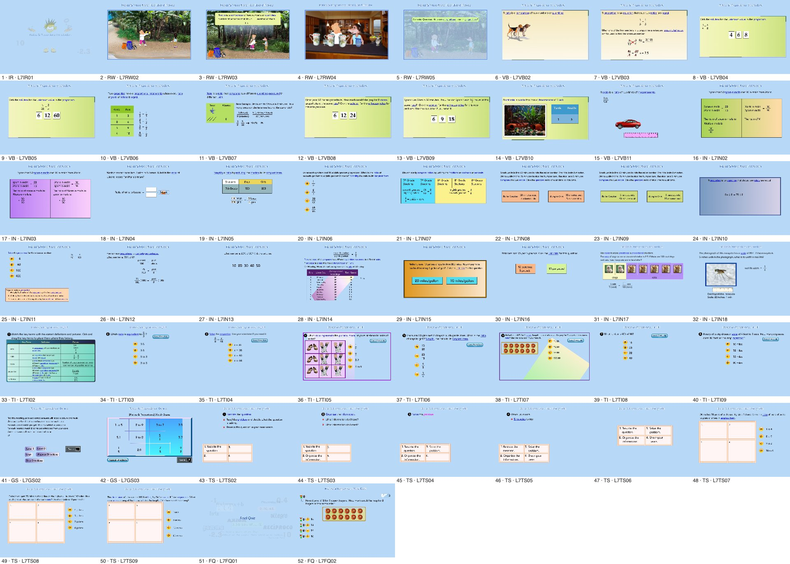
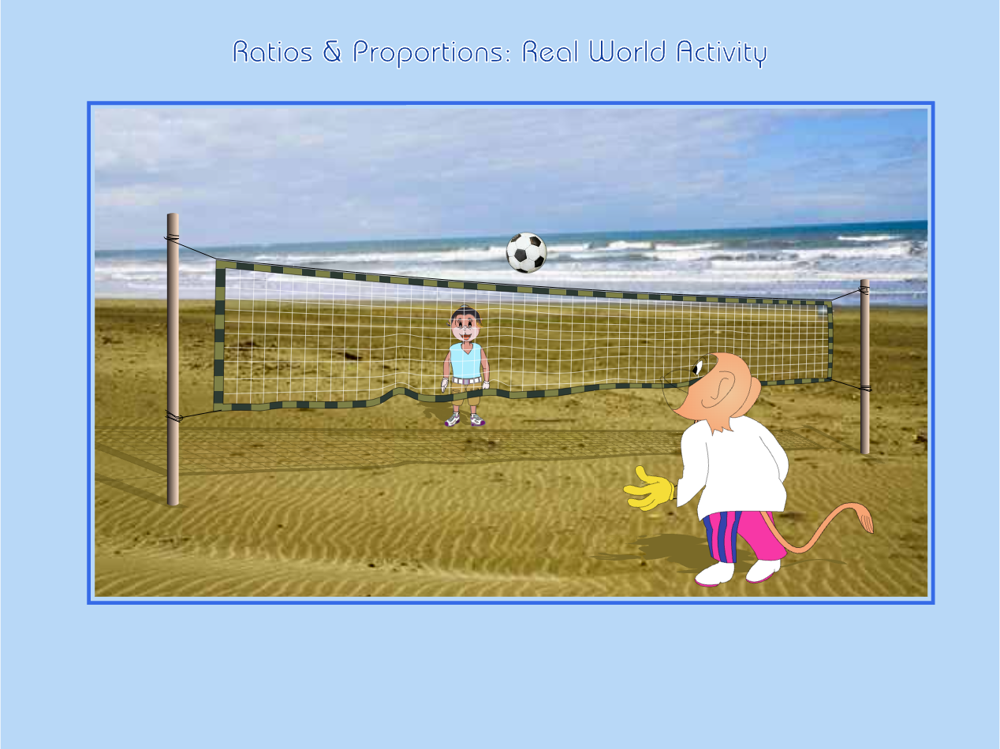
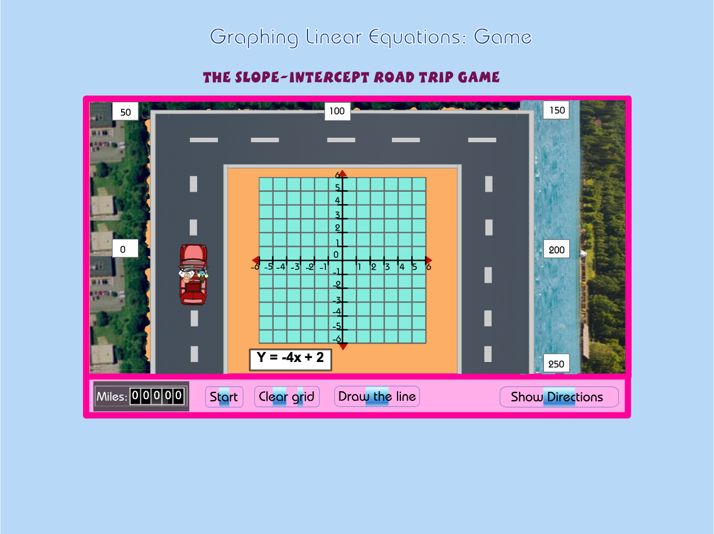

# HFR sample conversion: what HFR output looks like

**Engineering sample, 10–11 October 2026.** A grade-6 lesson and the two pages Codex was working on, converted automatically from the original Flash SWF files into TypeScript page modules, plus a TypeScript runtime that plays them in a browser.

This is not product code, not registered, and not reviewed for fidelity, listening or Owner acceptance. The original SWF files were only read; nothing in the Codex G6–G8 worktree was changed.

| Sample | Source | Pages |
| --- | --- | --- |
| **NMS Lesson 7 "Ratios & Proportions"** (grade-6 content, CCSS 6.RP) | `NMS002/L7/*.swf` | all 52 active placements |
| **ALG Lesson 8 P040 + P050** (the "Slope-Intercept Road Trip" game and the final quiz) | `ALG001/L8/GS/L8GS02.swf`, `ALG001/L8/FQ/L8FQ02.swf` | 2 |

## Results

| Check | Result |
| --- | --- |
| Pages converted | 54 of 54 (52 + 2), with no manual steps. The whole lesson compiles in about 2.5 s |
| Generated TypeScript | 54 page modules, 1,881 script functions, about 20,600 lines |
| Structured translation | 2,378 of 2,378 code bodies became readable TypeScript (`if`/`else`, loops, `&&`/`\|\|`, `?:`); zero used the explicit-stack fallback |
| Differential behaviour check | **54 of 54 pages identical** to the original bytecode. Each page plays to rest, then every control is activated (291 controls, 363 shell calls), and the final display list and global variables are compared |
| Type check | `tsc` passes over the runtime and all 54 generated modules |
| Browser | All 52 Lesson 7 pages render with zero runtime errors. P040 plays a full round: question `Y = -4x + 2`, two correct points, "Draw the line", "Excellent!", Miles 00025 |
| Whole G6–G8 corpus (structuring only) | 118,923 code bodies in 2,851 SWFs: 99.67% structured, 0.33% exact fallback, 0 syntax errors |

## What the output looks like

Each page is three things:

```
out/<lesson>/
  lesson.json                         lesson outline (sections, pages, titles)
  verification.json                   differential check result per page
  pages/<placement-id>/
    <placement-id>.ts                 ← generated TypeScript: all page logic
    <placement-id>.js                 compiled from the .ts by tools/build.mjs
    <placement-id>.data.json          drawings, timelines, text, buttons, stream map
    <placement-id>.bytecode.json      original bytecode, kept only for verification
    media/                            narration MP3/WAV, bitmaps (JPEG/PNG), Spanish narration
```

### 1. The generated TypeScript module

This is P040's "check answer" button, exactly as the converter wrote it (`out/alg001-l08-p040-p050/pages/shared-alg001-l08-p040/shared-alg001-l08-p040.ts`, excerpt):

```ts
/**
 * HELP Math 2.0 · HFR page module · shared-alg001-l08-p040
 * Graphing Linear Functions · Game or Scenario · Game 1
 * Source: HELP_COURSES/ALG001/L8/GS/L8GS02.swf (SWF 6, sha256 0c6096016c0612fe…)
 * Generated by hfr-compile 0.1.0. … Do not edit by hand: regenerate, or add a reviewed overlay.
 * Code bodies: 74; structured: 74; explicit-stack fallback: 0.
 */
import type { Helpers, PageScripts } from "../../../../runtime/types";

export default function page(h: Helpers): PageScripts {
  const { add, arr, duplicateMovieClip, eq, fn, gt, inc, lt, mul, newObj, … } = h;
  return {
    /** on(release) for button #186 … */
    button186_release: ($, $$) => {
      $._global.LB = false;
      $._global.EB = false;
      if (!eq($._global.quizA?.indexOf?.($._global.AnsY), -1) && !eq($._global.quizA?.indexOf?.($._global.AnsC), -1)) {
        set($.MC_1, "_visible", true);
        $.MC_1?.gotoAndPlay?.($._global.ansLabel);
        $.doClearGrid?.();
        $.disableMC?.();
        $._global.startFlag = false;
        …
        if (!gt($.Mc_Car?._y, -226)) {
          if (eq($.Mc_Car?._rotation, 0)) {
            set($.Mc_Car, "_rotation", 90);
          }
        }
        …
        $._global.score = add($._global.score, 25);
        if (eq($._global.score?.toString?.()?.length, 3)) {
          set($.txtM5, "text", $._global.score?.toString?.()?.substring?.(sub($._global.score?.toString?.()?.length, 1), $._global.score?.toString?.()?.length));
          …
        }
        $.Mc_Feed2?.gotoAndPlay?.(2);
      } else {
        $._global.quizTryCount = inc($._global.quizTryCount);
        …
      }
    },
```

How to read it:

- `$` is the ActionScript scope. `$.Mc_Car` finds the clip exactly as Flash did (timeline, `_global`, SWF 6 case-insensitive names). `$$` is the local scope (`var`).
- Operators that differ between ActionScript and JavaScript go through small helpers with exact ActionScript semantics: `add`, `eq`, `lt`, `gt`, `inc`, `truthy`. For example, `undefined + 25` is `25` in SWF 6.
- `?.` keeps Flash's rule that calling something missing does nothing. `set(obj, "prop", v)` does the same for assignments.
- Each function carries a comment saying where it came from: frame script, button, or clip event, plus the instance name and timeline.

### 2. The data file

Drawings and timelines are data, not code (`<placement-id>.data.json`, abbreviated):

```jsonc
{
  "schema": "hfr-page/1", "compiler": "hfr-compile 0.1.0",
  "placement": { "animationId": "shared-alg001-l08-p040", "lessonTitle": "Graphing Linear Functions", "sectionCode": "GS", "ordinal": 40, "titleEnglish": "Game 1" },
  "source": { "path": "HELP_COURSES/ALG001/L8/GS/L8GS02.swf", "sha256": "0c6096016c0612fe…", "swfVersion": 6 },
  "stage": { "width": 800, "height": 600, "fps": 12 },
  "module": "shared-alg001-l08-p040.js",
  "dictionary": {
    "1":   { "kind": "shape", "bounds": {…}, "draws": [ { "fill": { "t": "s", "c": [255,255,255,255] }, "path": "m-927 3208q65 18 118 64…" },
                                                     { "line": { "w": 60, "c": [0,0,0,51] }, "path": "m-13956 3208l84-9…" } ] },
    "255": { "kind": "sprite", "frameCount": 737, "labels": { "Repeat": 50, "Game_Start": 736 },
             "frames": [ [ { "op": "action", "script": "sprite255_frame1" }, { "op": "place", "depth": 1, "charId": 20, "clipDepth": 162 }, … ] ] }
    // also: morph shapes, fonts (glyph outlines + code tables), static/dynamic text, buttons (states + scripts), bitmaps, sounds
  },
  "streams": [ { "timeline": 219, "src": "media/stream0_tl219.mp3", "rate": 22050, "frames": [[2, 0], [3, 3456], …] } ]
}
```

Shape paths are SVG path data in twips, so the browser's `Path2D` reads them directly. The runtime **does not use FFDec or Ruffle**: rendering is HFR's own Canvas renderer.

### 3. Screens

| | |
| --- | --- |
|  | **All 52 pages of NMS Lesson 7**, 50 s into each page, rendered by the HFR runtime |
|  | Real World page 1 at the "begin" frame; matches an independent FFDec render of the same frame |
|  | P040 after pressing the game's own Start: random question generated by the page logic |
|  | P040 after clicking two correct points and "Draw the line": "Excellent!", score 25 |

## Run it

From this folder, with Node 24. The tools reuse the workbench's installed `esbuild` and `typescript` at `../../node_modules`.

**`out/` and `dist/` are not in Git.** They hold media and data extracted from the original SWFs, and the repository is public while the 1.0 asset rights are pending. In a fresh checkout, generate them first with access to the source archive and the G6–G8 release manifest (paths in `package.json`):

```bash
npm run compile:nms-l07 && npm run compile:p040-p050 && npm run build
```

Then start the viewer:

```bash
node tools/serve.mjs 8765
```

Open `http://127.0.0.1:8765/viewer/index.html`. The viewer stands in for My Lesson and shows the lesson outline (✓ = behaviour verified), the player, the generated TypeScript for the current page, the live shell-event log, and page info. Press **Start** once to enable audio.

Recompile the lesson from the original SWFs:

```bash
node compiler/compile-lesson.mjs "/Volumes/WestWorld/HELP MATH 2.0-g678-implementation/catalog/g678-page-only-release-manifest.v1.json" "/Volumes/WestWorld/HELP MATH Related Files/AWS Grade-Classified Courseware/G6-G8-shared" NMS002 7 out/nms002-l07
```

Build the page modules and the viewer bundle:

```bash
node tools/build.mjs
```

Run the differential check (generated TypeScript vs original bytecode). It writes `verification.json`:

```bash
../../node_modules/.bin/esbuild tools/verify.ts --bundle --platform=node --format=esm --outfile=dist/verify.mjs && node dist/verify.mjs out/nms002-l07 /tmp/hfr-verify ../../node_modules/esbuild/lib/main.js
```

Type-check the runtime and every generated page:

```bash
node ../../node_modules/typescript/bin/tsc -p tsconfig.json
```

## Source layout

| Path | Lines | What |
| --- | ---: | --- |
| `compiler/swf.mjs` | 415 | SWF 6/7 parser: shapes (fill0/fill1 edge assembly → path data), morph shapes, fonts, text, edit text, buttons, bitmaps, sounds, timelines |
| `compiler/decompile.mjs` | 573 | AVM1 bytecode → structured TypeScript, with the explicit-stack fallback |
| `compiler/media.mjs` | 149 | JPEG repair, lossless bitmaps → PNG, ADPCM/PCM → WAV, stream MP3 assembly |
| `compiler/compile-page.mjs`, `compile-lesson.mjs` | 173 | Writes the `.ts`, `.data.json`, media and lesson outline |
| `runtime/avm.ts` | 502 | ActionScript object model, coercions, reference interpreter (oracle) |
| `runtime/display.ts` | 771 | Display list, timeline, built-ins, the 1.0 course-shell adapter, input |
| `runtime/helpers.ts` | 125 | The helper layer used by generated pages (Proxies + exact operators) |
| `runtime/render.ts` | 244 | Canvas renderer (shapes, gradients, bitmaps, morphs, glyph text, masks, colour transforms) and hit testing |
| `runtime/audio.ts`, `player.ts`, `types.ts` | 126 | WebAudio narration sync, page player, shared types |
| `viewer/`, `tools/` | | Sample viewer, build, static server, differential verifier |

## Known gaps (to be closed in Sprint 1)

- **No pixel comparison with an authoritative runtime yet.** One page was checked against an independent FFDec render of the same frame; the Ruffle differential oracle (spec §11, T1) is still to be built.
- **Rendering details to verify:** P040's control labels show thin blue bars, probably button highlight shapes Flash draws differently. Dynamic text uses embedded glyphs when the font has advances, otherwise a web font. Bitmap fills ignore colour tints. Device fonts are approximated.
- **Audio:** narration sync follows Flash streaming semantics in real time. Spanish narration plays the lesson's `SA/<page>.mp3` as a host feature (the viewer's ES button). Final-quiz audio requests are logged, not yet routed.
- **Accessibility mirror** (DOM text and focusable button proxies) is specified but not built in this sample.
- **Primitive method calls** in generated code use JavaScript's string and number methods, which match ActionScript for everything these pages use. The verifier found no difference; pages that extend `String.prototype` would need the exact helper form.
