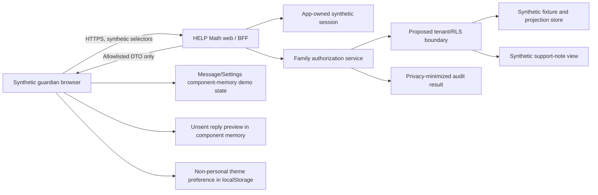
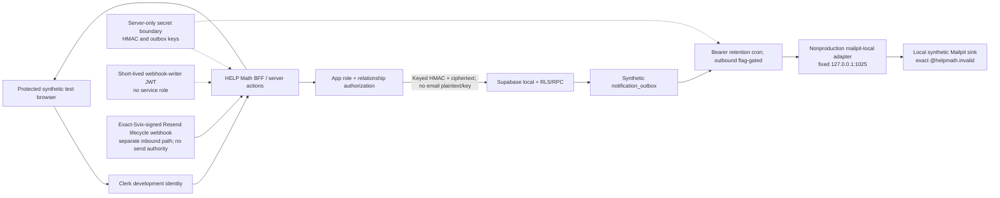

# Family portal data flow and subprocessor boundaries

Status: **Proposed architecture; no provider or production data flow is approved by this document**

## Phase 1 flows

### Default `synthetic_ui_demo`



### Controlled `synthetic_integration_test`



Both diagrams are target contracts. Candidate BFF/database/RLS artifacts may be
present in the worktree, but the diagram does not assert that they conform, are
deployed, are connected to providers, or are approved.

Neither Phase 1 profile has a permitted path from the family surface to:

- a real SIS, OneRoster source, district identity provider, parent email/phone,
  historical HELP Math database, or real roster;
- Learning Locker raw statements or the anonymous actor cookie/seed;
- Nova/OpenRouter/model providers;
- any real/arbitrary email address, SMS, push notification, contact intake,
  third-party chat or webhook destination. The controlled profile's sole email
  exception is the exact reserved-domain recipient routed to the fixed loopback
  Mailpit sink. The current policy does not authorize Resend/Internet egress;
- FLA/SWF/source archives, migration evidence, or private release ledgers;
- the learner's My Lesson write/session state.

## Trust boundaries

### Browser boundary

The browser is untrusted. Route state, query parameters, local storage, hidden
fields, response objects, and JavaScript state cannot establish role, tenant,
learner relationship, content access, or feature mode. Browser-local Phase 1
thread state is presentation-only and cannot change a server record or notify a
person. Message read/terminal-close/filter state, reply previews, and Settings
demo toggles remain in component memory and are not persisted. Only the
non-personal theme preference may use `localStorage`.

### Web/BFF boundary

The family BFF must:

- require an app-owned server-validated session;
- derive user and tenant from the session;
- validate exact request DTOs and reject unknown fields;
- call the family authorization service for every learner-scoped operation;
- return only an exact allowlisted response DTO;
- set private/no-store caching and non-indexing headers;
- avoid putting protected values in URLs, analytics, logs, exceptions, traces,
  screenshots, or client telemetry;
- fail closed when synthetic mode or a required kill switch is absent.
- derive and enforce the exact Phase 1 profile; default UI-demo requests cannot
  reach integration actions/RPCs/outbox/provider paths.

### Identity boundary

An external identity provider may prove control of a provider account; it does
not assign the HELP Math application role or guardian/learner relationship. The
application mapping and tenant-scoped authorization record are authoritative.
Phase 1 may use only synthetic candidate identities. The controlled profile uses
Clerk development identity only; no production Clerk tenant/account is implied.
No provider profile is copied into a family DTO or treated as application role
or relationship authority.

For the controlled local-Mailpit recipient match, the server-only action
validates the exact provider issuer/subject and verified synthetic email claim,
normalizes the email,
and computes a keyed HMAC with `FAMILY_EMAIL_DIGEST_KEY`. The database receives
only the HMAC plus the already mapped issuer/subject context needed by the exact
accept transaction. It never receives email plaintext and never holds the HMAC
key or the outbox decryption key. A missing/invalid key, issuer mismatch, direct
RPC bypass, or ambiguous identity fails closed.

#### Explicit guardian tenant selection

One signed application identity may have active guardian roles in more than one
tenant. The database authorization context may contain at most 100 server-only
tenant entries with opaque ID, display name, environment, data mode and roles.
The BFF filters that list to the exact requested role and exposes only each
allowed tenant's opaque `id` and reviewed `displayName`; provider identifiers,
environment, data mode and role arrays never enter the selector DTO.

Selecting a tenant writes an eight-hour HttpOnly, `SameSite=Lax`, path-rooted
tenant cookie after re-reading the signed authorization context. The UUID is a
locator, not authority. The action clears the selected-child cookie before
revalidation so a child ID from the former tenant cannot be carried forward.
Every destination read and mutation reauthorizes the chosen tenant and resource,
returns only one tenant workspace, and never merges reports across tenants.

Migration 013 is the current implementation candidate for closing the former
unscoped-default-child defect. It removes authenticated execute from the old
unscoped core and exposes `family_workspace_for_tenant_v1(tenant, child?)`.
That wrapper re-derives the signed guardian, exact tenant, active role/link,
child, school and current enrollment; when child is absent it chooses a default
only inside that tenant and validates the returned tenant/child receipt. The app
repository also rejects any returned tenant mismatch. This is
`CLOSED_DYNAMIC_LOCAL`: the final 001–018 seed, pgTAP, HTTP, cookie-clear and
same-identity/two-tenant no-merge tests passed together. Hosted behavior remains
unverified.

The same server authorization context may include a server-only
`messagingEnabled` value for each authorized tenant. Browser selector DTOs still
receive only opaque `id` and reviewed `displayName`. Effective server messaging
is the logical AND of global `FAMILY_MESSAGING_ENABLED` and the exact tenant's
default-off `family_messaging_enabled` safety mirror. The tenant column is an
implementation layer of the already approved Messaging control, not a new
product flag.

### Data/RLS boundary

The candidate database design is a defense-in-depth boundary, not the sole
authorization layer. The service layer and RLS must independently require the
same server-derived tenant and active relationship. Administrative/service
roles are separate, least-privileged, and audited. Direct browser database
access is not assumed or authorized by this packet. The exact eighteen migrations,
fictional seed and pgTAP plan passed in a fresh local PostgreSQL 16 database
(`489/489`, 38/38 public tables RLS-enabled). A disposable
loopback PostgreSQL 16.15/PostgREST 16.2/GoTrue 2.195/Mailpit 1.31/gateway
harness also verified the dedicated invitation-issuer and webhook-writer role
transitions and negative matrices against the exact current 001–018 artifact.
The protected local product flow also passed, including a Mailpit recovery link,
PKCE callback, password update, old-password denial, generic duplicate sign-up
response and exact-one auth/provider identity cardinality. A real local GoTrue
refresh grant retained the mapped application authorization context; the runner
then globally revoked the production-shaped administrator session and restarted
Next with provider, cutover, Portal, Messaging and Email disabled, after which
all four Family/auth entry paths returned `404`. Hosted Supabase/asymmetric-key
behavior, hosted recovery/refresh/rollback, release configuration and deployment
remain unverified.

### Production-shaped read adapters remain release-disabled

Authorized non-demo (`context.synthetic === false`) route code no longer substitutes demo fixtures or
returns `notFound()` merely because the context is non-synthetic. It uses the
request-scoped provider token and exact app-owned role/tenant context to call one
of three security-definer read RPCs:

| Surface | Exact RPC | Fail-closed application boundary |
|---|---|---|
| Family | `family_workspace_for_tenant_v1(uuid, uuid)` | `guardian` + `family:read`; explicit selected tenant and optional selected child are parsed as UUID locators; signed guardian, active role/relationship, tenant, child, school and enrollment are rechecked; strict Family DTO; complete admitted history of at most 200 messages per thread, redacted tombstones, privacy-safe `messageContacts`, and school announcements; no `lessonHref` in RPC, DTO/type or UI. The predecessor unscoped function is an owner-only core with no request-role execute. |
| Teacher Messages | `teacher_family_inbox_v1()` | `teacher` + `family:teacher-message`; exact teacher participation and school/class/enrollment scope rechecked; strict bounded teacher inbox DTO. |
| Teacher announcement composer | `teacher_announcement_schools_v1()`, then `authorize_school_announcement_publish_v1(uuid)` and `publish_school_announcement_v1(...)` | `teacher` + `family:announce`; strict tenant plus 1–100 unique school ID/label allowlist; current tenant/school/role/class/staff scope rechecked; action cross-checks the returned tenant/school IDs before publishing bounded plain text. Absence or any shape/authorization mismatch disables composition. No roster, recipient, learner or destination enters the DTO. |
| Admin Family Access | `admin_family_access_workspace_v1()` | `school_admin` or `district_admin` + `family:manage-access`; exact tenant/school/student scope rechecked; strict child/invitation DTO with masked/generic adult destination label only. |

Each repository uses the ordinary request client, never `service_role`; rejects
a returned tenant mismatch; maps authorization denial to `403` and missing/out-
of-scope resource to `404`; and treats an absent RPC, database error, unknown
field or invalid DTO as unavailable. The service-role client lives in a
separate notification/retention cron-only module; ordinary repositories and
the public webhook do not import a module capable of reading that credential.
Layouts/responses are private and no-store.
This is a production-shaped contract only. Phase 1 still requires the selected
database tenant/environment to be synthetic. No real identity, PII, hosted
Supabase/PostgREST, dynamic RLS behavior, external tenant, deployment or
real-family approval is established, so all real-family flags remain off.

### Projection boundary

The family portal consumes a minimal logical family progress projection, not raw
event rows. `family_progress_projection` names that conceptual contract. The
candidate physical projections are `progress_projections_v1` and
`skill_projections_v1`; the candidate `family_workspace_for_tenant_v1`
security-definer RPC
also computes a small synthetic count/time aggregate from `learning_events_v2`.
That internal aggregation does not authorize direct `learning_events_v2` table
access or raw payload return. The projection carries source version/watermark
and explicit content release IDs. It excludes raw answers, exact free text,
Nova data, device data, other learners, and migration acceptance conclusions.

The existing anonymous learning-event path is not a bridge to family identity.
No historical anonymous event is assigned to a learner based on a cookie,
device, time, name, or later sign-in.

Candidate real-time `LearningEventV2` ingest is narrower than a general
projection-concurrency guarantee. It requires `read committed`, one assignment
per batch, exactly one authorized student/enrollment mapping, and a transaction
lock on the uniquely resolved student row; violations fail closed. The
service-role `rebuild_family_projections_v1` path now takes the same student-row
lock. Against the exact current 001–018 artifact, the loopback harness ran one
HTTP ingest and one HTTP rebuild concurrently, observed two active PostgreSQL
backends, and verified both HTTP 200 results plus a consistent final event/
projection watermark. A separate two-concurrent-ingest race also passed;
hosted and production concurrency remain unverified.

### Signed-in learner assignment bridge

The optional projection-input path is distinct from the Family browser:

1. A signed-in learner opens the existing G4 L3 My Lesson route with an opaque
   assignment UUID. The query value is a locator only; no tenant, student,
   enrollment, role, release, page, or event authority comes from it.
2. The BFF requires the non-production application interlock, global Portal
   control, exact signed learner identity, and a database-backed context. The
   cookie-only synthetic demo cannot write events.
3. `learning_assignment_launch_v1` derives exactly one active
   tenant/issuer/learner-role/student/enrollment/assignment/class/school context,
   requires synthetic data mode plus the tenant Portal and internal event
   interlocks, and returns a server envelope containing `tenantId` and exactly
   39 contiguous G4 L3 placement/release bindings.
4. The BFF compares that `tenantId` with its signed authorization context,
   strips it before the browser, and cross-checks the launch against the existing
   My Lesson course href, release ID, source order, placement IDs and animation
   IDs. Any missing, duplicate, extra or mismatched field is a non-disclosing
   denial.
5. The player creates only current-session, in-memory events and flushes batches
   of at most 50 through a strict server action. It never reads, backfills, or
   uploads saved local progress, the legacy V1 pseudonymous LRS stream, answer
   data, Nova content, another lesson, or another learner. There is no persistent
   offline queue; an unsuccessful flush remains visibly unsynced.
6. `record_assignment_learning_events_v2` re-derives and locks current authority,
   rechecks the tenant/event interlocks and exact published placement tuple,
   rejects `practice_evaluated` and events more than 24 hours old, then calls the
   owner-internal generic ingest core. Its receipt carries server-only `tenantId`
   for BFF comparison and only `inserted`/`ignored` reaches the browser.
7. Existing event/projection retention anchors and the student-row coordination
   contract apply. A later Family read still receives only allowlisted aggregate
   projections; no raw event becomes selectable.

This bridge introduces no new subprocessor. It does not let a guardian continue
or impersonate a learner and does not establish Flash source custody,
Current-JS coverage, My Lesson integration/release, fidelity, audio, human/Owner
acceptance, strict completion, Lesson release, or publication.

### Governance and exact-thread support boundary

1. A guardian may submit a bounded access/correction/deletion/relationship-
   dispute request for an already authorized child. It enters a human-review
   queue; it does not directly modify a student record, relationship or
   retention state.
2. A current teacher may suggest family access for a learner in an active class,
   without entering an adult address. Reviewing the suggestion does not create
   an invitation or guardian link.
3. School/district administrators see only requests and suggestions within
   current scope. Their general operations workspace contains no message body
   and is not a message directory.
4. If a participant supplies one opaque thread reference, a scoped admin may
   request support access with a bounded reason. A different district admin must
   approve or deny. Approval is requestor-only, exact-thread and expires within
   15 minutes; every read and redaction rechecks current role/resource lifecycle.
5. Redaction replaces one message body with an audited tombstone. The original
   body and redaction reason/actor never enter the Family DTO or audit context.
6. Invitation decline uses the same fragment/session-key, verified-email HMAC
   and token-digest boundary as acceptance, reveals no invitation detail, and
   cancels pending invitation delivery on an exact match.

All three governance tables are RLS-enabled with zero direct product policies or
table grants. The current local pgTAP and protected browser product flow verify
the named paths; no hosted operating policy, staffing model or approval follows
from that evidence.

### Audit boundary

Audit events record a synthetic opaque actor, tenant, action code, target type,
opaque target ID/digest, allow/deny result, policy version, and time. They must
not record DTO bodies, note content, invite token, auth token, contact fields,
raw exception objects, or learner activity details.

## Phase 1 data lifecycle

1. A deterministic generator creates visibly fictitious fixture records with
   `data_mode=synthetic`, an environment ID, and `expires_at` no later than
   `created_at + 30 days`.
2. A synthetic application session selects an active synthetic tenant and
   `guardian` membership.
3. The server authorizes the selected synthetic learner through an active
   `guardian_links` row (the physical form of the conceptual
   `GuardianLearnerRelationship`).
4. A separately authenticated synthetic learner fixture may submit strict
   `LearningEventV2` batches only through `ingest_learning_events_v2`; the raw
   table has no family/guardian/teacher/admin select grant. This path does not
   ingest the existing anonymous LRS history.
5. The family projection service reads only synthetic, non-expired rows allowed
   by tenant and relationship policy.
6. The BFF emits an exact `family.synthetic.v1` DTO. Its candidate workspace RPC
   may compute bounded synthetic event counts/times internally but returns no raw
   event row or payload.
7. Mark-read/terminal-close/filter and Settings interactions remain
   component-memory demonstration state. A closed thread is read-only and has no
   reopen action. A synthetic reply preview is validated as plain text with a
   2,000-character maximum, held in browser memory, labeled unsent, and never
   posted to a backend.
8. In the controlled profile, server actions and transactional RPCs create and
   redeem a synthetic invite, persist only allowlisted synthetic thread/message
   data, publish only an authorized bounded synthetic school announcement,
   create an announcement private reply only as a separately authorized thread,
   enqueue only an allowlisted test-email event, deliver it solely to the fixed
   loopback Mailpit sink, revoke
   the relationship, and prove subsequent denial. After outbound flags turn off,
   retention and signed delivered/bounce/complaint/suppression recording remain
   available only to close already-stored work.
9. Expiration jobs delete primary rows, derived projections, test outbox/provider
   copies, local demo state
   on next load, and eligible backups within the 30-day maximum.
10. A privacy-safe deletion receipt records only counts, scope, job ID, completion
   time, and digest; it does not preserve deleted content.

## Candidate service and subprocessor inventory

The following table distinguishes existing project context from family-portal
authorization. `Not family-approved` means exactly that; it is not a statement
about a provider's general suitability or current production configuration.

| Service/category | Possible purpose | Phase 1 family data | Current family-portal status and boundary |
|---|---|---:|---|
| HELP Math web server / BFF | Serve UI, validate session, authorize and shape DTOs | Synthetic only | Candidate implementation exists in this worktree; exact conformance, deployment and approval are not established here. |
| Vercel | Potential web hosting/network delivery | Synthetic HTTP/technical metadata only if an exact deployment is later approved | Existing project provider context does not authorize a family deployment; region, logs, retention, DPA and exact settings require review. |
| Server secret store / environment injection | Hold `FAMILY_EMAIL_DIGEST_KEY`, the v2 outbox-encryption keyring/active key ID, optional bounded legacy-v1 read key, cron/Svix/provider credentials, and short-lived dedicated webhook-writer/invitation-issuer JWTs | Secret metadata and key versions only in evidence; never key/token values or email plaintext | Exact provider/configuration is undecided. HMAC/encryption/JWT/provider credentials are purpose-separated; database/browser/build/client telemetry have no HMAC/decryption capability. Candidate v2 derives token/email subkeys and binds purpose/tenant/record/key ID; static tests do not prove real provisioning or rotation. Public webhook and invitation routes get no `service_role`. Rotation follows the runbook and does not re-anchor synthetic records. |
| Clerk development candidate | Synthetic test identity proof | Synthetic development accounts only in the controlled profile | Phase 1 integration-test candidate; not a production identity cutover. Provider metadata cannot be application authorization. |
| Supabase-compatible local stack | Store synthetic tenants, roles, links, invite/message/outbox/audit/retention state; exercise RLS/RPC | Synthetic only in the controlled profile | Fresh local PostgreSQL plus PostgREST 16.2/GoTrue 2.195/Mailpit/gateway harness passed the named issuer/writer and concurrency checks. It may store a keyed email HMAC and application-encrypted test destination, but no email plaintext, HMAC key, or decryption key. Local evidence does not prove a hosted Supabase project, hosted asymmetric-key gateway, production configuration or real-family approval. |
| Learning Locker / xAPI | Existing pseudonymous learning-event delivery | No direct family access; no identity binding | Raw LRS is outside the family trust boundary. Any future projection ingestion needs a new identity, DPA, retention and authorization design. |
| OpenRouter / routed model / Nova | Learner tutor requests | None | Excluded from family portal. No prompt/reply or AI summary may enter family DTOs. |
| Local Mailpit sink | Controlled invite/message test delivery | Synthetic envelope/body to exact normalized `@helpmath.invalid` recipients only | Candidate transport is fixed to `127.0.0.1:1025`, has no auth/TLS because it is loopback-only, rejects production selection and disables file/URL access. It may run only in the isolated integration harness after access, capture, retention, deletion and cleanup evidence is bound. It is not a hosted subprocessor or an external-recipient approval. |
| Resend | Candidate production external mail transport and exact-Svix lifecycle events | No outbound Family mail under the current reserved-domain/loopback-only Phase 1 policy | A default-off `school-verified-production` code path now requires exact production/Supabase/Resend/retention/live-session gates, but it was verified only with fictional loopback data and no external send. Real key/account/from/to/domain use remains off and unapproved. The signed webhook route has no send authority. Any real outbound use still requires provider/DPA/log/retention/deletion review, district/Owner authorization and an exact release receipt. |
| Cloudflare Turnstile | Possible future anti-abuse signal | None | Not required for synthetic Phase 1; any use requires disclosed fields, retention and failure behavior. |
| District SIS / OneRoster | Future roster/relationship provisioning | None | Real integration prohibited until contract/DPA/district authorization and mapping/reconciliation design exist. |
| District IdP / Google / Microsoft / Clever / ClassLink | Future tenant identity federation | None | Provider and scope undecided; synthetic demo cannot imply integration readiness. |
| Any other email, SMS or push provider | Future adult invite/notification | None | Excluded. The exact controlled test-email adapter above is the only Phase 1 exception. |
| Error/observability provider | Availability/security telemetry | Minimal synthetic operational metadata only if approved | Product payloads, tokens, note content and learner data are denied; exact vendor/configuration/retention remains a gate. |

No service may be called a legal "subprocessor" for the family portal solely
because it appears in this candidate inventory. Counsel/contract owners must
classify each exact service and flow. Conversely, omitting a service from the
public UI does not remove a legal or security review obligation if it processes
family data in the real architecture.

Supabase local and Mailpit are intended as developer-owned local processes for
the controlled test, not hosted subprocessor claims. Clerk development may
still receive synthetic account metadata; its test accounts, regions, logs,
retention and deletion remain part of Phase 1 security/privacy review even
though no real PII is authorized. Nothing in this inventory selects a provider
for real families.

### Controlled server-path boundary

Message/invite server actions, transactional RPCs, notification outbox triggers,
cron/webhook routes, and test-email templates are in scope for the controlled
integration profile and default off. Before that profile is enabled, the exact
artifact inventory and runtime trace must prove:

- `authenticated`, `service_role` and `public` cannot execute create/resend.
  Candidate server actions first obtain a one-use, 90-second, exact-actor/
  student/email/idempotency attestation, then call through a short-lived ES256
  `family_invitation_issuer` bearer. The custom role has no table or unrelated-
  function authority. Local PostgreSQL/pgTAP verified the role, grants and
  attestation contract; the exact current 001–018 loopback PostgREST harness
  then verified HTTP create/resend and the anon/authenticated/service-role/
  wrong-purpose/wrong-audience/table/cross-RPC denial matrix. Hosted gateway
  behavior and production credential rotation remain open; the exact protected
  local product invite E2E passed;
- candidate v2 invitation-token and email-destination envelopes use an explicit
  key ID, purpose-derived subkeys and immutable tenant/record/purpose AAD.
  Static cross-purpose/record/tenant swap tests pass; real keyring provision,
  overlap/retirement, compromise and backup behavior remain open;
- candidate outbox persistence recursively rejects forbidden fields, bounds
  depth/nodes/bytes, and enforces exact per-kind top-level JSON shapes. The
  exact local PostgreSQL/pgTAP run passed; deployed worker-negative and provider/
  no-egress traces remain open;

- the default UI demo keeps global `FAMILY_MESSAGING_ENABLED`, every tenant
  `family_messaging_enabled` mirror, and `FAMILY_EMAIL_NOTIFICATIONS_ENABLED`
  off and no local reply, mark-read,
  terminal-close, Settings, or page-load action reaches an integration path;
- the controlled profile enables both Messaging layers only for the exact
  synthetic tenant, then enables only the reviewed actions/RPCs/outbox/cron/
  webhook and test-email adapter needed for the E2E. Direct authenticated send,
  mark-read, close, Teacher publish/inbox and preference opt-in recheck the
  tenant mirror. Disabling the tenant mirror cancels pending `family_message`
  outbox rows, and service claim plus immediate pre-send validation recheck it.
  Existing Family workspace/history and school-announcement reads remain read-
  only; revocation, relinquishment, redaction and retention remain callable;
- with valid `CRON_SECRET`, the candidate cron route remains reachable and the
  worker invokes bounded service-only retention before product-flag branching.
  If either portal or email is off, it skips weekly digest, claim and all
  egress. Only when both are on may the integration branch enqueue the weekly
  synthetic digest, claim a lease, revalidate it immediately before send, call
  the test adapter, and complete by claim-token CAS. The worker must parse every
  returned retention run and return a retryable failure unless every tenant
  status is `succeeded`. The provider webhook remains reachable after outbound
  flags turn off, requires an exact valid Svix signature, and records only an
  allowlisted delivered/bounce/complaint/suppression event through
  `record_family_email_delivery_event_v1` using a short-lived dedicated
  `family_webhook_writer` JWT plus publishable key—not `service_role`—and never
  directly updates outbox state. Local issuer/audience/role/expiry parsing is
  only preflight; the exact current 001–018 loopback PostgREST harness verified
  strict HTTP 204,
  exactly one event/outbox transition, sole-RPC/no-table/no-sequence authority,
  and denial for anon/authenticated/`service_role`/wrong-audience/table/cross-
  RPC attempts. Hosted asymmetric-key
  verification and production token rotation remain dynamic gates;
- every actor, tenant, learner, thread, body, from address and destination is
  synthetic; the destination matches the exact reserved-domain server policy,
  and delivery uses only the non-production fixed loopback Mailpit transport;
- every adult-email digest is a versioned keyed HMAC computed only in the
  server action; bare SHA-256, browser/database computation, key exposure, and
  database decryption are prohibited;
- no real/production provider credential, account, destination, or data is
  present; and
- a missing or malformed flag cannot select a real/provider fallback.

Non-test configurations and real/arbitrary destinations remain unreachable.
The presence of code alone keeps the integration messaging/email gates open;
documentation cannot close them.

## Egress rules

Default egress is deny. The UI-demo profile has no message/invite egress. The
controlled integration profile may make only the exact identity/database/test-
email outbound calls bound to its receipt. The lifecycle webhook is separately
an authenticated inbound event path, not outbound authority. In particular:

- no client-to-database direct call unless a separately reviewed design proves
  app authorization and RLS for the exact SDK operation;
- no family endpoint sends data to Nova/model providers or Learning Locker;
- no invite/message/contact endpoint calls an arbitrary email/SMTP, SMS, push,
  webhook, or third-party chat destination; the controlled test adapter is the
  exact outbound exception, and its event ingress requires exact Svix
  verification plus an allowlisted event type;
- no remote image, avatar, tracking pixel, link preview, or attachment fetch;
- no analytics event contains user/learner/thread/invite IDs, route parameters
  that identify records, note content, or progress detail;
- CSP/connect-src and server egress policies must reflect the exact allowlist,
  and unexpected egress blocks release.

## Logging and cache rules

Allowed logs are event codes and minimal operational dimensions, for example:

```json
{
  "event": "family.authorization.denied",
  "dataMode": "synthetic",
  "policyVersion": "family-authz-v1",
  "reasonCode": "NO_ACTIVE_RELATIONSHIP",
  "requestId": "opaque-uuid"
}
```

Do not log raw headers, cookies, request/response bodies, query strings,
provider objects, stack-local secrets, invite tokens, aliases, progress, note
content, or IDs that can be joined outside the isolated synthetic environment.
Debug logging is not a reason to widen this boundary.

Family responses are private and `no-store` by default. CDN/shared cache,
incremental static regeneration, public prefetch artifacts, and search indexing
are denied until an exact design proves user/tenant isolation and deletion.

## Real-family transition gate

Before any real flow is enabled, replace this synthetic diagram with an exact,
versioned data-flow diagram and field inventory that identifies:

- legal entity/controller/processor roles and jurisdiction;
- all providers, accounts/projects, regions, contracts, DPA/subprocessor terms,
  log/backup/retention settings and deletion paths;
- adult/learner identity proof and authoritative relationship source;
- district notice/consent/legal basis and responsibility split;
- every browser, server, database, event, notification, analytics, support,
  export/delete, backup and incident path;
- purpose and retention for each data class;
- data-rights and support channel;
- rollback, kill switches, restoration suppression and evidence receipts.

That successor flow requires Privacy, legal, DPA/contract, district, security,
Owner, and exact-release approval. No Phase 1 result closes those gates.
